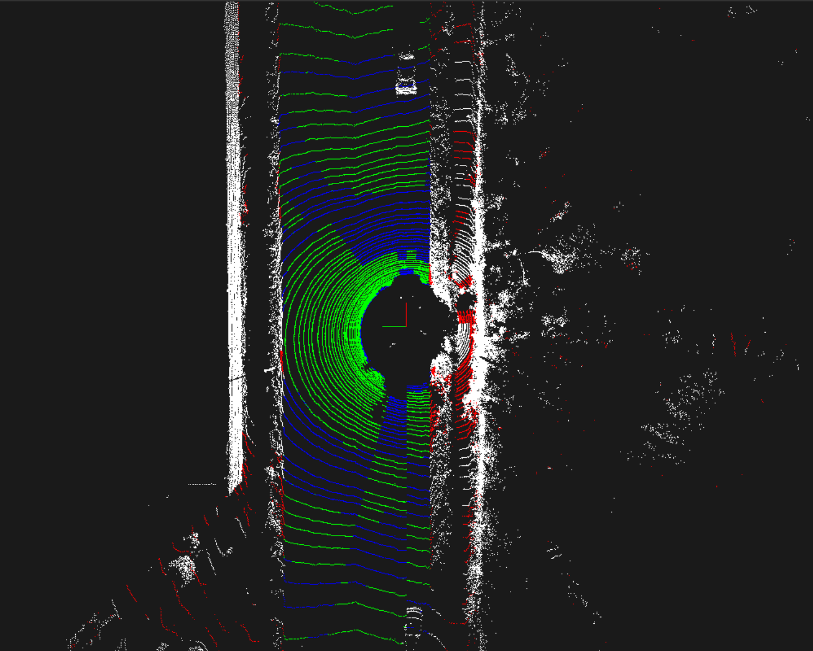
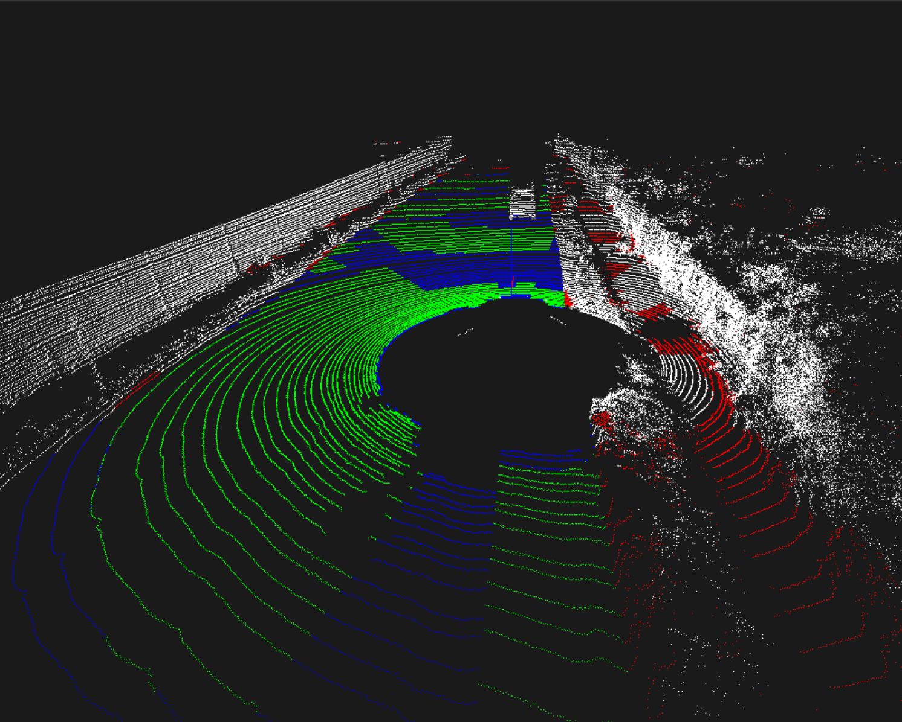

## Parallel 3D Ground Segmentation
[](https://ieeexplore.ieee.org/document/5548059)
[](https://en.wikipedia.org/wiki/C%2B%2B)
<br>

This project implements and parallelizes the algorithm described in *Fast Segmentation of 3D Point Clouds for Ground Vehicles,
Himmelsbach et al. (2010)* [(link)](https://ieeexplore.ieee.org/document/5548059), which focuses on the segmentation 
of ground points in a LiDAR point cloud. The algorithm is first implemented sequentially in C++ and the parallelized using the
OpenMP API, achieving significant speedups compared to the sequential baseline.

### Report
A full analysis of the algorithm, its parallelization and the performance evaluation is available in the 
[report](report/Parallel_3D_ground_segmentation_Alessio_Piroli_Parallel_Computing.pdf).

### How to run
You need [Pangolin](https://github.com/stevenlovegrove/Pangolin) to visualize the segmented point clouds.

### Cloning the repository
```bash
git clone https://github.com/alessiopiroli/parallel-3d-ground-segmentation.git
cd parallel-3d-ground-segmentation
```

### Building the project
```bash
mkdir build
cd build
cmake ..
make
```

### Running the code
```bash
./parallel-3d-ground-segmentation
```
When running the code the ground points will be segmented and a Pangolin window will be opened to visualize the result.

### Dataset
The scenes used are from the [SemanticKITTI dataset](https://semantic-kitti.org/).
Each scene includes a `.bin` file with the raw LiDAR point cloud and a `.label` file with the class of each point.

### Segmentation Examples
Below are shown the qualitative results of the implemented ground segmentation algorithm when using a LiDAR
point cloud in an urban environment.

<p align="center">
  
  
</p>

https://github.com/user-attachments/assets/f6fcd77d-1e52-419b-a5ba-4f2455d6cbb7

- **White** = correctly identified non-ground points (true negatives)  
- **Green** = correctly identified ground points (true positives)
- **Red** = points incorrectly classified as ground (false positives)  
- **Blue** = points incorrectly classified as non-ground (false negatives)
