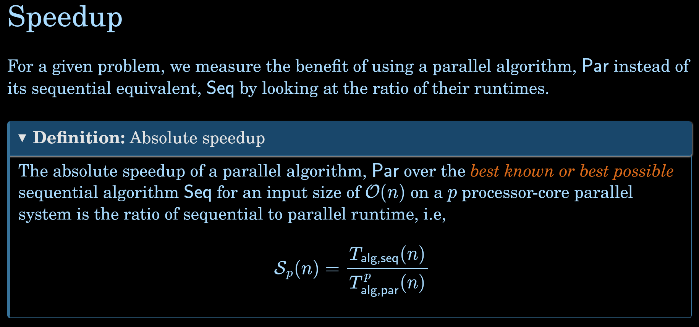
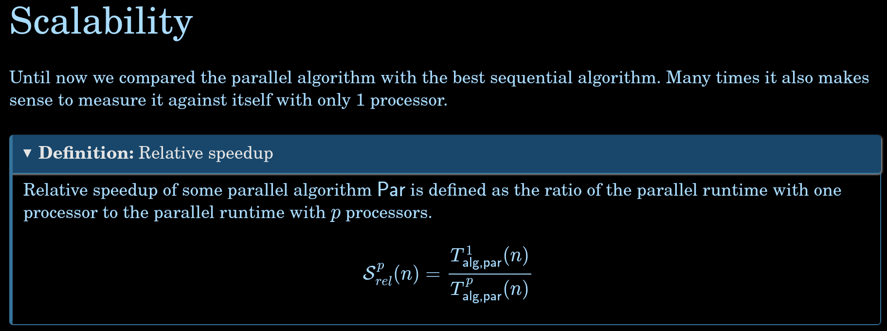

# Variables:
 - Number of **segments**
 - Number of **bins**
 - Number of **points**

 # What I want to show
 - Overall function: ***Full segmentation***
 - Function 1: **Sorting points between segments and bins**
 - Function 2: **Assigning prototype points**
 - Function 3: **Line fitting**
 - Function 4: **Ground point segmentation**
 - Function 5: **Remaining poinnt segmentation**

 Each plot needs to show how the variation of the number of threads affects the functions when the internal parameters change.
 For example, we will compare sequential and parallel executions with different number of threads: 1, 2, 4, 8, 16.
 
 ---
 
 After fine-tuning, the following parameter values achieved the highest mIoU of 61%[1]:
 - Number of segments = 50
 - Number of bins = 14
 - Max slope = 0.3
 - Vertical distance treshold = 0.15 
 - Max y intercept = 0.2
 - Max rmse = 0.3

# Functions that benefit from parallelism
- **par_seg_and_bin_sorting**: The entirety of the lidar_data is split between threads.
- **par_assign_prototype**: The size of binned_segments is split between threads, then the size of the prototype points is split between threads.
- **par_fit_lines**: The size of the segments is split between threads.
- **par_ground_point_classification**: The size of lidar_data is split between threads.
- **slow_par_remaining_points_classification**: The function is mainly sequential, the work is divided between threads only when we use the reduction keyword to get the minimum values and assigning an ID to each segmented cluster.
- **par_remaining_points_classficiation**: This function is identical to the sequential version, which is used in the parallel general segmentation.

# Metrics to track
## Absolute speedup


## Scalability: Relative Speedup


# Experiment 1: number of data
With the parameters fixed at their optimal values, we analyze performance using 25%, 50%, 75% and 100% of the total number of points.

### 25% of total data:
#### N_THREADS = 1
```bash
N_THREADS = 1
Number of original points: 125822
Sequential Reduced number of points: 31455
Parallel Reduced number of points: 31455
Sequential duration: 18.8507
Sequential functions durations
Function 1 duration:    1.66744
Function 2 duration:    0.350214
Function 3 duration:    0.0784653
Function 4 duration:    2.79414
Function 5 duration:    13.8731

Parallel duration: 19.599
Parallel functions durations
Function 1 duration:    1.92226
Function 2 duration:    0.347367
Function 3 duration:    0.0807151
Function 4 duration:    2.84793
Function 5 duration:    14.3149
```

---

#### N_THREADS = 2
```bash
N_THREADS = 2
Number of original points: 125822
Sequential Reduced number of points: 31455
Parallel Reduced number of points: 31455
Sequential duration: 18.8156
Sequential functions durations
Function 1 duration:    1.65692
Function 2 duration:    0.351519
Function 3 duration:    0.0782216
Function 4 duration:    2.795
Function 5 duration:    13.8558

Parallel duration: 18.1477
Parallel functions durations
Function 1 duration:    1.30519
Function 2 duration:    0.179055
Function 3 duration:    0.0436919
Function 4 duration:    1.4404
Function 5 duration:    15.0846
```

---

#### N_THREADS = 4
```bash
N_THREADS = 4
Number of original points: 125822
Sequential Reduced number of points: 31455
Parallel Reduced number of points: 31455
Sequential duration: 18.8937
Sequential functions durations
Function 1 duration:    1.67515
Function 2 duration:    0.356465
Function 3 duration:    0.07881
Function 4 duration:    2.8306
Function 5 duration:    13.8636

Parallel duration: 17.1181
Parallel functions durations
Function 1 duration:    1.23284
Function 2 duration:    0.117018
Function 3 duration:    0.0335044
Function 4 duration:    1.12446
Function 5 duration:    14.5041
```

---

#### N_THREADS = 8
```bash
N_THREADS = 8
Number of original points: 125822
Sequential Reduced number of points: 31455
Parallel Reduced number of points: 31455
Sequential duration: 19.1844
Sequential functions durations
Function 1 duration:    1.70324
Function 2 duration:    0.358809
Function 3 duration:    0.0790713
Function 4 duration:    2.86354
Function 5 duration:    14.0858

Parallel duration: 16.7943
Parallel functions durations
Function 1 duration:    1.42609
Function 2 duration:    0.0795579
Function 3 duration:    0.0339317
Function 4 duration:    0.616711
Function 5 duration:    14.5217
```

---

#### N_THREADS = 12
```bash
N_THREADS = 12
Number of original points: 125822
Sequential Reduced number of points: 31455
Parallel Reduced number of points: 31455
Sequential duration: 18.9632
Sequential functions durations
Function 1 duration:    1.68411
Function 2 duration:    0.362405
Function 3 duration:    0.0806292
Function 4 duration:    2.83391
Function 5 duration:    13.9114

Parallel duration: 18.3029
Parallel functions durations
Function 1 duration:    1.78604
Function 2 duration:    0.0575363
Function 3 duration:    0.0253417
Function 4 duration:    0.415177
Function 5 duration:    15.8768
```

---

#### N_THREADS = 16
```bash
N_THREADS = 16
Number of original points: 125822
Sequential Reduced number of points: 31455
Parallel Reduced number of points: 31455
Sequential duration: 19.2608
Sequential functions durations
Function 1 duration:    1.70289
Function 2 duration:    0.360784
Function 3 duration:    0.0800241
Function 4 duration:    2.83704
Function 5 duration:    14.1851

Parallel duration: 25.986
Parallel functions durations
Function 1 duration:    2.75539
Function 2 duration:    3.726
Function 3 duration:    1.45777
Function 4 duration:    1.61763
Function 5 duration:    16.2805
```

---

### 50% of total data:
#### N_THREADS = 1
```bash
N_THREADS = 1
Number of original points: 125822
Sequential Reduced number of points: 62911
Parallel Reduced number of points: 62911
Sequential duration: 26.3253
Sequential functions durations
Function 1 duration:    3.23065
Function 2 duration:    0.659724
Function 3 duration:    0.0831304
Function 4 duration:    5.85345
Function 5 duration:    16.3982

Parallel duration: 26.7413
Parallel functions durations
Function 1 duration:    3.6248
Function 2 duration:    0.624082
Function 3 duration:    0.087383
Function 4 duration:    5.94588
Function 5 duration:    16.3716
```

---

#### N_THREADS = 2
```bash
N_THREADS = 2
Number of original points: 125822
Sequential Reduced number of points: 62911
Parallel Reduced number of points: 62911
Sequential duration: 25.4791
Sequential functions durations
Function 1 duration:    3.08245
Function 2 duration:    0.639254
Function 3 duration:    0.0803594
Function 4 duration:    5.63632
Function 5 duration:    15.9544

Parallel duration: 21.5906
Parallel functions durations
Function 1 duration:    2.17509
Function 2 duration:    0.323027
Function 3 duration:    0.0440969
Function 4 duration:    2.97397
Function 5 duration:    15.9869
```

---

#### N_THREADS = 4
```bash
N_THREADS = 4
Number of original points: 125822
Sequential Reduced number of points: 62911
Parallel Reduced number of points: 62911
Sequential duration: 25.5308
Sequential functions durations
Function 1 duration:    3.1178
Function 2 duration:    0.64478
Function 3 duration:    0.084034
Function 4 duration:    5.71039
Function 5 duration:    15.8795

Parallel duration: 20.3689
Parallel functions durations
Function 1 duration:    1.88248
Function 2 duration:    0.198557
Function 3 duration:    0.0467689
Function 4 duration:    1.93432
Function 5 duration:    16.2053
```

---

#### N_THREADS = 8
```bash
N_THREADS = 8
Number of original points: 125822
Sequential Reduced number of points: 62911
Parallel Reduced number of points: 62911
Sequential duration: 25.8435
Sequential functions durations
Function 1 duration:    3.15618
Function 2 duration:    0.650262
Function 3 duration:    0.0821617
Function 4 duration:    5.71097
Function 5 duration:    16.1498

Parallel duration: 20.159
Parallel functions durations
Function 1 duration:    1.84298
Function 2 duration:    0.125172
Function 3 duration:    0.0354616
Function 4 duration:    1.25409
Function 5 duration:    16.7886
```

---

#### N_THREADS = 12
```bash
N_THREADS = 12
Number of original points: 125822
Sequential Reduced number of points: 62911
Parallel Reduced number of points: 62911
Sequential duration: 29.0655
Sequential functions durations
Function 1 duration:    3.5004
Function 2 duration:    0.721699
Function 3 duration:    0.0931968
Function 4 duration:    6.37669
Function 5 duration:    18.2667

Parallel duration: 34.3942
Parallel functions durations
Function 1 duration:    4.52518
Function 2 duration:    0.186093
Function 3 duration:    0.0624535
Function 4 duration:    1.13044
Function 5 duration:    28.1933
```

---

#### N_THREADS = 16
```bash
N_THREADS = 16
Number of original points: 125822
Sequential Reduced number of points: 62911
Parallel Reduced number of points: 62911
Sequential duration: 25.704
Sequential functions durations
Function 1 duration:    3.13932
Function 2 duration:    0.644133
Function 3 duration:    0.0825006
Function 4 duration:    5.7315
Function 5 duration:    16.0123

Parallel duration: 36.3881
Parallel functions durations
Function 1 duration:    3.88602
Function 2 duration:    4.58059
Function 3 duration:    2.19133
Function 4 duration:    2.42759
Function 5 duration:    23.0914
```

---

### 75% of total data:
#### N_THREADS = 1
```bash
N_THREADS = 1
Number of original points: 125822
Sequential Reduced number of points: 94366
Parallel Reduced number of points: 94366
Sequential duration: 31.9094
Sequential functions durations
Function 1 duration:    4.54726
Function 2 duration:    0.925393
Function 3 duration:    0.0831074
Function 4 duration:    8.55292
Function 5 duration:    17.7061

Parallel duration: 31.6811
Parallel functions durations
Function 1 duration:    4.81071
Function 2 duration:    0.878252
Function 3 duration:    0.083563
Function 4 duration:    8.48606
Function 5 duration:    17.3393
```

---

#### N_THREADS = 2
```bash
N_THREADS = 2
Number of original points: 125822
Sequential Reduced number of points: 94366
Parallel Reduced number of points: 94366
Sequential duration: 31.5069
Sequential functions durations
Function 1 duration:    4.53534
Function 2 duration:    0.922868
Function 3 duration:    0.083899
Function 4 duration:    8.52842
Function 5 duration:    17.3475

Parallel duration: 25.7223
Parallel functions durations
Function 1 duration:    3.02316
Function 2 duration:    0.461479
Function 3 duration:    0.0472256
Function 4 duration:    4.3757
Function 5 duration:    17.7183
```

---

#### N_THREADS = 4
```bash
N_THREADS = 4
Number of original points: 125822
Sequential Reduced number of points: 94366
Parallel Reduced number of points: 94366
Sequential duration: 32.8599
Sequential functions durations
Function 1 duration:    4.59338
Function 2 duration:    0.949513
Function 3 duration:    0.0877814
Function 4 duration:    8.60705
Function 5 duration:    18.5275

Parallel duration: 23.8614
Parallel functions durations
Function 1 duration:    2.35688
Function 2 duration:    0.27167
Function 3 duration:    0.0351244
Function 4 duration:    2.53774
Function 5 duration:    18.5549
```

---

#### N_THREADS = 8
```bash
N_THREADS = 8
Number of original points: 125822
Sequential Reduced number of points: 94366
Parallel Reduced number of points: 94366
Sequential duration: 32.9812
Sequential functions durations
Function 1 duration:    4.6558
Function 2 duration:    0.944658
Function 3 duration:    0.0861769
Function 4 duration:    8.80176
Function 5 duration:    18.3971

Parallel duration: 22.7552
Parallel functions durations
Function 1 duration:    2.26366
Function 2 duration:    0.183141
Function 3 duration:    0.0296477
Function 4 duration:    1.87029
Function 5 duration:    18.2821
```

---

#### N_THREADS = 12
```bash
N_THREADS = 12
Number of original points: 125822
Sequential Reduced number of points: 94366
Parallel Reduced number of points: 94366
Sequential duration: 33.6187
Sequential functions durations
Function 1 duration:    4.83445
Function 2 duration:    0.966737
Function 3 duration:    0.0871305
Function 4 duration:    8.89629
Function 5 duration:    18.7339

Parallel duration: 32.7484
Parallel functions durations
Function 1 duration:    3.88844
Function 2 duration:    0.211625
Function 3 duration:    0.0441793
Function 4 duration:    1.48362
Function 5 duration:    26.9353
```

---

#### N_THREADS = 16
```bash
N_THREADS = 16
Number of original points: 125822
Sequential Reduced number of points: 94366
Parallel Reduced number of points: 94366
Sequential duration: 32.2035
Sequential functions durations
Function 1 duration:    4.56143
Function 2 duration:    0.941077
Function 3 duration:    0.0838695
Function 4 duration:    8.57056
Function 5 duration:    17.9526

Parallel duration: 32.3546
Parallel functions durations
Function 1 duration:    3.5591
Function 2 duration:    2.1436
Function 3 duration:    1.14154
Function 4 duration:    2.06895
Function 5 duration:    23.2609
```

---

### 100% of total data:
#### N_THREADS = 1
```bash
N_THREADS = 1
Number of original points: 125822
Sequential Reduced number of points: 125822
Parallel Reduced number of points: 125822
Sequential duration: 39.1859
Sequential functions durations
Function 1 duration:    6.18661
Function 2 duration:    1.18111
Function 3 duration:    0.0866323
Function 4 duration:    11.8388
Function 5 duration:    19.7958

Parallel duration: 39.7348
Parallel functions durations
Function 1 duration:    6.65493
Function 2 duration:    1.21148
Function 3 duration:    0.0885504
Function 4 duration:    11.7317
Function 5 duration:    19.9534
```

---

#### N_THREADS = 2
```bash
N_THREADS = 2
Number of original points: 125822
Sequential Reduced number of points: 125822
Parallel Reduced number of points: 125822
Sequential duration: 38.8087
Sequential functions durations
Function 1 duration:    6.03597
Function 2 duration:    1.20454
Function 3 duration:    0.0849487
Function 4 duration:    11.7955
Function 5 duration:    19.5935

Parallel duration: 34.1626
Parallel functions durations
Function 1 duration:    4.3123
Function 2 duration:    0.738518
Function 3 duration:    0.0532498
Function 4 duration:    6.62458
Function 5 duration:    22.3216
```

---

#### N_THREADS = 4
```bash
N_THREADS = 4
Number of original points: 125822
Sequential Reduced number of points: 125822
Parallel Reduced number of points: 125822
Sequential duration: 38.9317
Sequential functions durations
Function 1 duration:    6.08403
Function 2 duration:    1.19922
Function 3 duration:    0.0842125
Function 4 duration:    11.8497
Function 5 duration:    19.6227

Parallel duration: 36.4128
Parallel functions durations
Function 1 duration:    3.96728
Function 2 duration:    0.470288
Function 3 duration:    0.0489785
Function 4 duration:    4.55039
Function 5 duration:    27.219
```

---

#### N_THREADS = 8
```bash
N_THREADS = 8
Number of original points: 125822
Sequential Reduced number of points: 125822
Parallel Reduced number of points: 125822
Sequential duration: 43.5203
Sequential functions durations
Function 1 duration:    6.74801
Function 2 duration:    1.33184
Function 3 duration:    0.0929729
Function 4 duration:    13.1282
Function 5 duration:    22.1133

Parallel duration: 36.6172
Parallel functions durations
Function 1 duration:    4.20657
Function 2 duration:    0.322449
Function 3 duration:    0.0487007
Function 4 duration:    2.9715
Function 5 duration:    28.8924
```

---

#### N_THREADS = 12
```bash
N_THREADS = 12
Number of original points: 125822
Sequential Reduced number of points: 125822
Parallel Reduced number of points: 125822
Sequential duration: 39.2036
Sequential functions durations
Function 1 duration:    6.12641
Function 2 duration:    1.17659
Function 3 duration:    0.0836729
Function 4 duration:    11.8584
Function 5 duration:    19.8675

Parallel duration: 27.3748
Parallel functions durations
Function 1 duration:    2.975
Function 2 duration:    0.203607
Function 3 duration:    0.0256371
Function 4 duration:    1.67035
Function 5 duration:    22.3664
```

---

#### N_THREADS = 16
```bash
N_THREADS = 16
Number of original points: 125822
Sequential Reduced number of points: 125822
Parallel Reduced number of points: 125822
Sequential duration: 39.2779
Sequential functions durations
Function 1 duration:    6.17132
Function 2 duration:    1.21218
Function 3 duration:    0.0842038
Function 4 duration:    11.9017
Function 5 duration:    19.8124

Parallel duration: 53.3165
Parallel functions durations
Function 1 duration:    6.33479
Function 2 duration:    5.09933
Function 3 duration:    2.75094
Function 4 duration:    4.66089
Function 5 duration:    34.2362
```

## Experiment 2: Number of segments
We keep the number of points to 100% of the total size and we vary the number of segments, keeping the other parameters at the optimum.

### NUM_SEGMENTS = 1:
#### N_THREADS = 1
```bash
N_THREADS: 1
N_SEGMENTS: 1
Sequential duration: 39.3816
Sequential functions durations
Function 1 duration:    3.97728
Function 2 duration:    1.12747
Function 3 duration:    0.0060065
Function 4 duration:    13.2256
Function 5 duration:    21.0383

Parallel duration: 38.663
Parallel functions durations
Function 1 duration:    4.0448
Function 2 duration:    1.17354
Function 3 duration:    0.00643945
Function 4 duration:    12.7603
Function 5 duration:    20.6713
```

#### N_THREADS = 2
```bash
N_THREADS: 2
N_SEGMENTS: 1
Sequential duration: 40.3828
Sequential functions durations
Function 1 duration:    4.16595
Function 2 duration:    1.14445
Function 3 duration:    0.0062211
Function 4 duration:    13.2743
Function 5 duration:    21.7844

Parallel duration: 32.6741
Parallel functions durations
Function 1 duration:    3.52388
Function 2 duration:    1.19612
Function 3 duration:    0.0060785
Function 4 duration:    6.62706
Function 5 duration:    21.0136
```

#### N_THREADS = 4
```bash
N_THREADS: 4
N_SEGMENTS: 1
Sequential duration: 39.6332
Sequential functions durations
Function 1 duration:    3.98207
Function 2 duration:    1.13767
Function 3 duration:    0.0058468
Function 4 duration:    13.3043
Function 5 duration:    21.1966

Parallel duration: 28.0534
Parallel functions durations
Function 1 duration:    1.59899
Function 2 duration:    1.23579
Function 3 duration:    0.0058756
Function 4 duration:    3.77667
Function 5 duration:    21.4277
```

#### N_THREADS = 8
```bash
N_THREADS: 8
N_SEGMENTS: 1
Sequential duration: 39.5461
Sequential functions durations
Function 1 duration:    3.97397
Function 2 duration:    1.13313
Function 3 duration:    0.0059555
Function 4 duration:    13.2754
Function 5 duration:    21.1508

Parallel duration: 29.9845
Parallel functions durations
Function 1 duration:    1.58294
Function 2 duration:    1.39207
Function 3 duration:    0.0072496
Function 4 duration:    3.04645
Function 5 duration:    23.9444
```

#### N_THREADS = 12
```bash
N_THREADS: 12
N_SEGMENTS: 1
Sequential duration: 39.7402
Sequential functions durations
Function 1 duration:    3.99951
Function 2 duration:    1.14452
Function 3 duration:    0.00614305
Function 4 duration:    13.2973
Function 5 duration:    21.2852

Parallel duration: 28.6786
Parallel functions durations
Function 1 duration:    1.45615
Function 2 duration:    1.25932
Function 3 duration:    0.00833105
Function 4 duration:    2.07418
Function 5 duration:    23.8676
```

#### N_THREADS = 16
```bash
N_THREADS: 16
N_SEGMENTS: 1
Sequential duration: 39.4887
Sequential functions durations
Function 1 duration:    4.01003
Function 2 duration:    1.12588
Function 3 duration:    0.00623335
Function 4 duration:    13.2179
Function 5 duration:    21.1202

Parallel duration: 32.6273
Parallel functions durations
Function 1 duration:    1.66262
Function 2 duration:    2.55714
Function 3 duration:    0.757877
Function 4 duration:    2.56304
Function 5 duration:    25.0739
```

---

### NUM_SEGMENTS = 10:
#### N_THREADS = 1
```bash
N_THREADS: 1
N_SEGMENTS: 10
Sequential duration: 35.9454
Sequential functions durations
Function 1 duration:    4.20906
Function 2 duration:    1.18688
Function 3 duration:    0.0256652
Function 4 duration:    10.6841
Function 5 duration:    19.8127

Parallel duration: 39.9777
Parallel functions durations
Function 1 duration:    4.93771
Function 2 duration:    1.36327
Function 3 duration:    0.0291099
Function 4 duration:    11.6489
Function 5 duration:    21.9725
```

#### N_THREADS = 2
```bash
N_THREADS: 2
N_SEGMENTS: 10
Sequential duration: 35.2271
Sequential functions durations
Function 1 duration:    4.13776
Function 2 duration:    1.16112
Function 3 duration:    0.0250659
Function 4 duration:    10.5456
Function 5 duration:    19.3329

Parallel duration: 27.4645
Parallel functions durations
Function 1 duration:    2.3892
Function 2 duration:    0.608997
Function 3 duration:    0.0157184
Function 4 duration:    5.57959
Function 5 duration:    18.8463
```

#### N_THREADS = 4
```bash
N_THREADS: 4
N_SEGMENTS: 10
Sequential duration: 35.2569
Sequential functions durations
Function 1 duration:    4.11404
Function 2 duration:    1.16959
Function 3 duration:    0.0252204
Function 4 duration:    10.6076
Function 5 duration:    19.3162

Parallel duration: 25.5143
Parallel functions durations
Function 1 duration:    2.15389
Function 2 duration:    0.391184
Function 3 duration:    0.0132137
Function 4 duration:    3.36179
Function 5 duration:    19.5668
```

#### N_THREADS = 8
```bash
N_THREADS: 8
N_SEGMENTS: 10
Sequential duration: 35.6257
Sequential functions durations
Function 1 duration:    4.20108
Function 2 duration:    1.20197
Function 3 duration:    0.02628
Function 4 duration:    10.7117
Function 5 duration:    19.4582

Parallel duration: 24.0914
Parallel functions durations
Function 1 duration:    1.66545
Function 2 duration:    0.292014
Function 3 duration:    0.0111815
Function 4 duration:    2.45405
Function 5 duration:    19.6359
```

#### N_THREADS = 12
```bash
N_THREADS: 12
N_SEGMENTS: 10
Sequential duration: 34.5704
Sequential functions durations
Function 1 duration:    4.05767
Function 2 duration:    1.13469
Function 3 duration:    0.0242519
Function 4 duration:    10.4722
Function 5 duration:    18.8591

Parallel duration: 24.9811
Parallel functions durations
Function 1 duration:    1.61486
Function 2 duration:    0.230763
Function 3 duration:    0.0106115
Function 4 duration:    1.69522
Function 5 duration:    21.3862
```

#### N_THREADS = 16
```bash
N_THREADS: 16
N_SEGMENTS: 10
Sequential duration: 35.0194
Sequential functions durations
Function 1 duration:    4.29142
Function 2 duration:    1.14879
Function 3 duration:    0.0248538
Function 4 duration:    10.4182
Function 5 duration:    19.1097

Parallel duration: 34.7944
Parallel functions durations
Function 1 duration:    2.15157
Function 2 duration:    2.4589
Function 3 duration:    0.960489
Function 4 duration:    2.43193
Function 5 duration:    26.7406
```

---

### NUM_SEGMENTS = 50:
#### N_THREADS = 1
```bash
N_THREADS: 1
N_SEGMENTS: 50
Sequential duration: 34.3758
Sequential functions durations
Function 1 duration:    4.52121
Function 2 duration:    1.29165
Function 3 duration:    0.0837224
Function 4 duration:    9.15009
Function 5 duration:    19.232

Parallel duration: 33.6902
Parallel functions durations
Function 1 duration:    4.78581
Function 2 duration:    1.27881
Function 3 duration:    0.0859137
Function 4 duration:    8.96641
Function 5 duration:    18.4868
```

#### N_THREADS = 2
```bash
N_THREADS: 2
N_SEGMENTS: 50
Sequential duration: 33.7281
Sequential functions durations
Function 1 duration:    4.47418
Function 2 duration:    1.26364
Function 3 duration:    0.083528
Function 4 duration:    9.0743
Function 5 duration:    18.7337

Parallel duration: 26.8084
Parallel functions durations
Function 1 duration:    2.82109
Function 2 duration:    0.65004
Function 3 duration:    0.0470904
Function 4 duration:    4.81712
Function 5 duration:    18.3821
```

#### N_THREADS = 4
```bash
N_THREADS: 4
N_SEGMENTS: 50
Sequential duration: 38.4081
Sequential functions durations
Function 1 duration:    5.07945
Function 2 duration:    1.42447
Function 3 duration:    0.0946446
Function 4 duration:    10.3305
Function 5 duration:    21.3688

Parallel duration: 40.034
Parallel functions durations
Function 1 duration:    4.46761
Function 2 duration:    0.662987
Function 3 duration:    0.0654395
Function 4 duration:    4.89693
Function 5 duration:    29.732
```

#### N_THREADS = 8
```bash
N_THREADS: 8
N_SEGMENTS: 50
Sequential duration: 34.6135
Sequential functions durations
Function 1 duration:    4.57177
Function 2 duration:    1.30937
Function 3 duration:    0.0870314
Function 4 duration:    9.35365
Function 5 duration:    19.1949

Parallel duration: 30.5574
Parallel functions durations
Function 1 duration:    2.69371
Function 2 duration:    0.332466
Function 3 duration:    0.0409427
Function 4 duration:    2.4411
Function 5 duration:    24.8916
```

#### N_THREADS = 12
```bash
N_THREADS: 12
N_SEGMENTS: 50
Sequential duration: 33.4805
Sequential functions durations
Function 1 duration:    4.64746
Function 2 duration:    1.26958
Function 3 duration:    0.0837458
Function 4 duration:    8.8831
Function 5 duration:    18.5006

Parallel duration: 27.2115
Parallel functions durations
Function 1 duration:    2.16551
Function 2 duration:    0.220598
Function 3 duration:    0.0232186
Function 4 duration:    1.4944
Function 5 duration:    23.1795
```

#### N_THREADS = 16
```bash
N_THREADS: 16
N_SEGMENTS: 50
Sequential duration: 33.6036
Sequential functions durations
Function 1 duration:    4.43875
Function 2 duration:    1.27129
Function 3 duration:    0.0838738
Function 4 duration:    9.0448
Function 5 duration:    18.6742

Parallel duration: 36.7642
Parallel functions durations
Function 1 duration:    3.01515
Function 2 duration:    4.21605
Function 3 duration:    2.2192
Function 4 duration:    3.10428
Function 5 duration:    24.0767
```

---

### NUM_SEGMENTS = 100:
#### N_THREADS = 1
```bash
N_THREADS: 1
N_SEGMENTS: 100
Sequential duration: 33.3137
Sequential functions durations
Function 1 duration:    4.66347
Function 2 duration:    1.32823
Function 3 duration:    0.143662
Function 4 duration:    8.72284
Function 5 duration:    18.2888

Parallel duration: 33.9279
Parallel functions durations
Function 1 duration:    5.2044
Function 2 duration:    1.36022
Function 3 duration:    0.14876
Function 4 duration:    8.72675
Function 5 duration:    18.3292
```

#### N_THREADS = 2
```bash
N_THREADS: 2
N_SEGMENTS: 100
Sequential duration: 33.4761
Sequential functions durations
Function 1 duration:    4.73143
Function 2 duration:    1.33081
Function 3 duration:    0.14556
Function 4 duration:    8.68911
Function 5 duration:    18.4002

Parallel duration: 26.8647
Parallel functions durations
Function 1 duration:    3.11155
Function 2 duration:    0.684372
Function 3 duration:    0.0757072
Function 4 duration:    4.57555
Function 5 duration:    18.2531
```

#### N_THREADS = 4
```bash
N_THREADS: 4
N_SEGMENTS: 100
Sequential duration: 33.439
Sequential functions durations
Function 1 duration:    4.72996
Function 2 duration:    1.34473
Function 3 duration:    0.144454
Function 4 duration:    8.69176
Function 5 duration:    18.3548

Parallel duration: 24.2702
Parallel functions durations
Function 1 duration:    2.32843
Function 2 duration:    0.375012
Function 3 duration:    0.0483516
Function 4 duration:    2.52671
Function 5 duration:    18.8138
```

#### N_THREADS = 8
```bash
N_THREADS: 8
N_SEGMENTS: 100
Sequential duration: 33.7226
Sequential functions durations
Function 1 duration:    4.8131
Function 2 duration:    1.37542
Function 3 duration:    0.149649
Function 4 duration:    8.82229
Function 5 duration:    18.3911

Parallel duration: 27.1034
Parallel functions durations
Function 1 duration:    2.9709
Function 2 duration:    0.820409
Function 3 duration:    0.0657528
Function 4 duration:    2.16262
Function 5 duration:    20.8485
```

#### N_THREADS = 12
```bash
N_THREADS: 12
N_SEGMENTS: 100
Sequential duration: 38.4946
Sequential functions durations
Function 1 duration:    5.40499
Function 2 duration:    1.52984
Function 3 duration:    0.166652
Function 4 duration:    10.0021
Function 5 duration:    21.1966

Parallel duration: 33.4223
Parallel functions durations
Function 1 duration:    4.40934
Function 2 duration:    0.309451
Function 3 duration:    0.0553366
Function 4 duration:    1.69928
Function 5 duration:    26.6249
```

#### N_THREADS = 16
```bash
N_THREADS: 16
N_SEGMENTS: 100
Sequential duration: 34.0874
Sequential functions durations
Function 1 duration:    4.79057
Function 2 duration:    1.38649
Function 3 duration:    0.149207
Function 4 duration:    8.80016
Function 5 duration:    18.7805

Parallel duration: 29.6172
Parallel functions durations
Function 1 duration:    3.72984
Function 2 duration:    1.18883
Function 3 duration:    0.408405
Function 4 duration:    1.70958
Function 5 duration:    22.3374
```

---

### NUM_SEGMENTS = 250:
#### N_THREADS = 1
```bash
N_THREADS: 1
N_SEGMENTS: 250
Sequential duration: 39.1761
Sequential functions durations
Function 1 duration:    6.02606
Function 2 duration:    1.78513
Function 3 duration:    0.350713
Function 4 duration:    9.5462
Function 5 duration:    21.0348

Parallel duration: 39.9913
Parallel functions durations
Function 1 duration:    7.39849
Function 2 duration:    1.74014
Function 3 duration:    0.352607
Function 4 duration:    9.46176
Function 5 duration:    20.6317
```

#### N_THREADS = 2
```bash
N_THREADS: 2
N_SEGMENTS: 250
Sequential duration: 34.7343
Sequential functions durations
Function 1 duration:    5.32773
Function 2 duration:    1.58147
Function 3 duration:    0.31305
Function 4 duration:    8.50423
Function 5 duration:    18.6131

Parallel duration: 28.3687
Parallel functions durations
Function 1 duration:    4.0503
Function 2 duration:    0.825684
Function 3 duration:    0.171894
Function 4 duration:    4.58533
Function 5 duration:    18.3671
```

#### N_THREADS = 4
```bash
N_THREADS: 4
N_SEGMENTS: 250
Sequential duration: 35.071
Sequential functions durations
Function 1 duration:    5.4175
Function 2 duration:    1.60698
Function 3 duration:    0.307785
Function 4 duration:    8.49407
Function 5 duration:    18.8572

Parallel duration: 27.8816
Parallel functions durations
Function 1 duration:    3.68917
Function 2 duration:    0.472251
Function 3 duration:    0.113572
Function 4 duration:    2.65528
Function 5 duration:    20.508
```

#### N_THREADS = 8
```bash
N_THREADS: 8
N_SEGMENTS: 250
Sequential duration: 35.5513
Sequential functions durations
Function 1 duration:    5.45381
Function 2 duration:    1.62865
Function 3 duration:    0.318032
Function 4 duration:    8.657
Function 5 duration:    19.0943

Parallel duration: 35.9781
Parallel functions durations
Function 1 duration:    6.31915
Function 2 duration:    0.434043
Function 3 duration:    0.12218
Function 4 duration:    2.42159
Function 5 duration:    26.0323
```

#### N_THREADS = 12
```bash
N_THREADS: 12
N_SEGMENTS: 250
Sequential duration: 43.4666
Sequential functions durations
Function 1 duration:    6.68498
Function 2 duration:    1.99087
Function 3 duration:    0.382243
Function 4 duration:    10.4627
Function 5 duration:    23.4598

Parallel duration: 38.9721
Parallel functions durations
Function 1 duration:    8.42191
Function 2 duration:    0.353506
Function 3 duration:    0.120465
Function 4 duration:    1.66219
Function 5 duration:    27.6184
```

#### N_THREADS = 16
```bash
N_THREADS: 16
N_SEGMENTS: 250
Sequential duration: 35.0272
Sequential functions durations
Function 1 duration:    5.47022
Function 2 duration:    1.56811
Function 3 duration:    0.311454
Function 4 duration:    8.44466
Function 5 duration:    18.8442

Parallel duration: 42.0198
Parallel functions durations
Function 1 duration:    8.26199
Function 2 duration:    3.53108
Function 3 duration:    2.15117
Function 4 duration:    2.856
Function 5 duration:    24.6154
```

---

### NUM_SEGMENTS = 500:
#### N_THREADS = 1
```bash
N_THREADS: 1
N_SEGMENTS: 500
Sequential duration: 36.8838
Sequential functions durations
Function 1 duration:    6.24144
Function 2 duration:    1.8775
Function 3 duration:    0.580218
Function 4 duration:    8.52137
Function 5 duration:    18.9573

Parallel duration: 43.8252
Parallel functions durations
Function 1 duration:    8.93143
Function 2 duration:    2.13818
Function 3 duration:    0.654674
Function 4 duration:    9.6778
Function 5 duration:    21.6304
```

#### N_THREADS = 2
```bash
N_THREADS: 2
N_SEGMENTS: 500
Sequential duration: 35.9441
Sequential functions durations
Function 1 duration:    6.06143
Function 2 duration:    1.84835
Function 3 duration:    0.564118
Function 4 duration:    8.29974
Function 5 duration:    18.4538

Parallel duration: 36.1788
Parallel functions durations
Function 1 duration:    6.4946
Function 2 duration:    1.15513
Function 3 duration:    0.382614
Function 4 duration:    5.21559
Function 5 duration:    22.0814
```

#### N_THREADS = 4
```bash
N_THREADS: 4
N_SEGMENTS: 500
Sequential duration: 36.1839
Sequential functions durations
Function 1 duration:    6.14587
Function 2 duration:    1.89563
Function 3 duration:    0.566983
Function 4 duration:    8.29913
Function 5 duration:    18.5606

Parallel duration: 28.4904
Parallel functions durations
Function 1 duration:    5.06805
Function 2 duration:    0.566731
Function 3 duration:    0.198605
Function 4 duration:    2.68464
Function 5 duration:    19.2175
```

#### N_THREADS = 8
```bash
N_THREADS: 8
N_SEGMENTS: 500
Sequential duration: 36.1024
Sequential functions durations
Function 1 duration:    6.10928
Function 2 duration:    1.86833
Function 3 duration:    0.564819
Function 4 duration:    8.29997
Function 5 duration:    18.5306

Parallel duration: 29.9641
Parallel functions durations
Function 1 duration:    6.82962
Function 2 duration:    0.397502
Function 3 duration:    0.198396
Function 4 duration:    1.98399
Function 5 duration:    19.7372
```

#### N_THREADS = 12
```bash
N_THREADS: 12
N_SEGMENTS: 500
Sequential duration: 36.4776
Sequential functions durations
Function 1 duration:    6.16998
Function 2 duration:    1.87326
Function 3 duration:    0.562571
Function 4 duration:    8.33818
Function 5 duration:    18.82

Parallel duration: 32.0792
Parallel functions durations
Function 1 duration:    9.28788
Function 2 duration:    0.307995
Function 3 duration:    0.163911
Function 4 duration:    1.32868
Function 5 duration:    20.1058
```

#### N_THREADS = 16
```bash
N_THREADS: 16
N_SEGMENTS: 500
Sequential duration: 36.3779
Sequential functions durations
Function 1 duration:    6.15075
Function 2 duration:    1.87243
Function 3 duration:    0.569979
Function 4 duration:    8.35371
Function 5 duration:    18.7071

Parallel duration: 55.7209
Parallel functions durations
Function 1 duration:    12.3688
Function 2 duration:    7.98704
Function 3 duration:    3.96131
Function 4 duration:    4.93662
Function 5 duration:    25.4796
```

---

### NUM_SEGMENTS = 750:
#### N_THREADS = 1
```bash
N_THREADS: 1
N_SEGMENTS: 750
Sequential duration: 36.7105
Sequential functions durations
Function 1 duration:    6.64669
Function 2 duration:    2.03425
Function 3 duration:    0.802414
Function 4 duration:    8.12237
Function 5 duration:    18.0891

Parallel duration: 39.8731
Parallel functions durations
Function 1 duration:    8.94295
Function 2 duration:    2.01691
Function 3 duration:    0.815364
Function 4 duration:    8.26105
Function 5 duration:    18.8315
```

#### N_THREADS = 2
```bash
N_THREADS: 2
N_SEGMENTS: 750
Sequential duration: 45.4787
Sequential functions durations
Function 1 duration:    8.23854
Function 2 duration:    2.5432
Function 3 duration:    0.988645
Function 4 duration:    10.0039
Function 5 duration:    22.4682

Parallel duration: 38.2858
Parallel functions durations
Function 1 duration:    7.86673
Function 2 duration:    1.24549
Function 3 duration:    0.54747
Function 4 duration:    5.21545
Function 5 duration:    22.1772
```

#### N_THREADS = 4
```bash
N_THREADS: 4
N_SEGMENTS: 750
Sequential duration: 37.8122
Sequential functions durations
Function 1 duration:    6.90492
Function 2 duration:    2.09672
Function 3 duration:    0.817392
Function 4 duration:    8.28816
Function 5 duration:    18.6431

Parallel duration: 29.6775
Parallel functions durations
Function 1 duration:    6.3973
Function 2 duration:    0.594884
Function 3 duration:    0.291347
Function 4 duration:    2.4091
Function 5 duration:    18.8942
```

#### N_THREADS = 8
```bash
N_THREADS: 8
N_SEGMENTS: 750
Sequential duration: 37.456
Sequential functions durations
Function 1 duration:    6.83038
Function 2 duration:    2.07012
Function 3 duration:    0.811146
Function 4 duration:    8.19958
Function 5 duration:    18.4699

Parallel duration: 49.4541
Parallel functions durations
Function 1 duration:    13.9314
Function 2 duration:    0.693532
Function 3 duration:    0.422353
Function 4 duration:    2.4153
Function 5 duration:    30.1819
```

#### N_THREADS = 12
```bash
N_THREADS: 12
N_SEGMENTS: 750
Sequential duration: 37.7411
Sequential functions durations
Function 1 duration:    6.81518
Function 2 duration:    2.10039
Function 3 duration:    0.811593
Function 4 duration:    8.32613
Function 5 duration:    18.6372

Parallel duration: 58.17
Parallel functions durations
Function 1 duration:    20.3006
Function 2 duration:    2.42259
Function 3 duration:    0.465475
Function 4 duration:    2.13447
Function 5 duration:    30.552
```

#### N_THREADS = 16
```bash
N_THREADS: 16
N_SEGMENTS: 750
Sequential duration: 37.835
Sequential functions durations
Function 1 duration:    6.82098
Function 2 duration:    2.11086
Function 3 duration:    0.825594
Function 4 duration:    8.37146
Function 5 duration:    18.6578

Parallel duration: 90.9523
Parallel functions durations
Function 1 duration:    27.4255
Function 2 duration:    11.7896
Function 3 duration:    5.85641
Function 4 duration:    7.03709
Function 5 duration:    36.3272
```

---

### NUM_SEGMENTS = 1000:
#### N_THREADS = 1
```bash
N_THREADS: 1
N_SEGMENTS: 1000
Sequential duration: 42.8883
Sequential functions durations
Function 1 duration:    8.10685
Function 2 duration:    2.54257
Function 3 duration:    1.18753
Function 4 duration:    9.10083
Function 5 duration:    20.4669

Parallel duration: 43.7802
Parallel functions durations
Function 1 duration:    10.6383
Function 2 duration:    2.31966
Function 3 duration:    1.13664
Function 4 duration:    8.7746
Function 5 duration:    19.5574
```

#### N_THREADS = 2
```bash
N_THREADS: 2
N_SEGMENTS: 1000
Sequential duration: 38.5116
Sequential functions durations
Function 1 duration:    7.34172
Function 2 duration:    2.25518
Function 3 duration:    1.0246
Function 4 duration:    8.14542
Function 5 duration:    18.3998

Parallel duration: 33.8701
Parallel functions durations
Function 1 duration:    7.72073
Function 2 duration:    1.15775
Function 3 duration:    0.613348
Function 4 duration:    4.40346
Function 5 duration:    18.6291
```

#### N_THREADS = 4
```bash
N_THREADS: 4
N_SEGMENTS: 1000
Sequential duration: 38.4279
Sequential functions durations
Function 1 duration:    7.31472
Function 2 duration:    2.24823
Function 3 duration:    1.04177
Function 4 duration:    8.15411
Function 5 duration:    18.3205

Parallel duration: 36.2943
Parallel functions durations
Function 1 duration:    8.96525
Function 2 duration:    0.747171
Function 3 duration:    0.398772
Function 4 duration:    2.62917
Function 5 duration:    21.8751
```

#### N_THREADS = 8
```bash
N_THREADS: 8
N_SEGMENTS: 1000
Sequential duration: 38.0609
Sequential functions durations
Function 1 duration:    7.24701
Function 2 duration:    2.22181
Function 3 duration:    1.03388
Function 4 duration:    8.09958
Function 5 duration:    18.1143

Parallel duration: 40.4522
Parallel functions durations
Function 1 duration:    13.7498
Function 2 duration:    0.611349
Function 3 duration:    0.485409
Function 4 duration:    2.03563
Function 5 duration:    21.7768
```

#### N_THREADS = 12
```bash
N_THREADS: 12
N_SEGMENTS: 1000
Sequential duration: 38.4709
Sequential functions durations
Function 1 duration:    7.41453
Function 2 duration:    2.20819
Function 3 duration:    1.02855
Function 4 duration:    8.21066
Function 5 duration:    18.3165

Parallel duration: 42.6917
Parallel functions durations
Function 1 duration:    17.3568
Function 2 duration:    0.446616
Function 3 duration:    0.321594
Function 4 duration:    1.33518
Function 5 duration:    21.4493
```

#### N_THREADS = 16
```bash
N_THREADS: 16
N_SEGMENTS: 1000
Sequential duration: 43.8566
Sequential functions durations
Function 1 duration:    8.29566
Function 2 duration:    2.56706
Function 3 duration:    1.18253
Function 4 duration:    9.30209
Function 5 duration:    20.9769

Parallel duration: 91.6236
Parallel functions durations
Function 1 duration:    33.2546
Function 2 duration:    11.336
Function 3 duration:    4.921
Function 4 duration:    5.62239
Function 5 duration:    33.5248
```

## Experiment 3: Number of bins
We keep the number of points to 100% of the total size and we vary the number of bins, keeping the other parameters at the optimum.

### NUM_BINS = 1:
#### N_THREADS = 1
```bash
N_THREADS: 1
N_BINS: 1
Sequential duration: 30.1193
Sequential functions durations
Function 1 duration:    4.10901
Function 2 duration:    1.1686
Function 3 duration:    0.00036115
Function 4 duration:    3.54772
Function 5 duration:    21.2681

Parallel duration: 30.8133
Parallel functions durations
Function 1 duration:    4.5986
Function 2 duration:    1.20625
Function 3 duration:    0.00085375
Function 4 duration:    3.41863
Function 5 duration:    21.5634
```

#### N_THREADS = 2
```bash
N_THREADS: 2
N_BINS: 1
Sequential duration: 30.7788
Sequential functions durations
Function 1 duration:    4.18777
Function 2 duration:    1.18131
Function 3 duration:    0.00028885
Function 4 duration:    3.62696
Function 5 duration:    21.7577

Parallel duration: 25.696
Parallel functions durations
Function 1 duration:    2.42128
Function 2 duration:    0.601607
Function 3 duration:    0.00087315
Function 4 duration:    1.67886
Function 5 duration:    20.972
```

#### N_THREADS = 4
```bash
N_THREADS: 4
N_BINS: 1
Sequential duration: 29.5829
Sequential functions durations
Function 1 duration:    4.03949
Function 2 duration:    1.14602
Function 3 duration:    0.00028605
Function 4 duration:    3.51694
Function 5 duration:    20.8574

Parallel duration: 25.3933
Parallel functions durations
Function 1 duration:    1.87661
Function 2 duration:    0.363848
Function 3 duration:    0.0009964
Function 4 duration:    1.16998
Function 5 duration:    21.9575
```

#### N_THREADS = 8
```bash
N_THREADS: 8
N_BINS: 1
Sequential duration: 30.3082
Sequential functions durations
Function 1 duration:    4.15136
Function 2 duration:    1.17317
Function 3 duration:    0.00029365
Function 4 duration:    3.60134
Function 5 duration:    21.3567

Parallel duration: 24.9176
Parallel functions durations
Function 1 duration:    1.78835
Function 2 duration:    0.291766
Function 3 duration:    0.0013731
Function 4 duration:    1.06205
Function 5 duration:    21.7461
```

#### N_THREADS = 12
```bash
N_THREADS: 12
N_BINS: 1
Sequential duration: 30.5125
Sequential functions durations
Function 1 duration:    4.15436
Function 2 duration:    1.15872
Function 3 duration:    0.0002638
Function 4 duration:    3.59708
Function 5 duration:    21.577

Parallel duration: 25.5337
Parallel functions durations
Function 1 duration:    1.55776
Function 2 duration:    0.21347
Function 3 duration:    0.0032695
Function 4 duration:    0.708515
Function 5 duration:    23.0166
```

#### N_THREADS = 16
```bash
N_THREADS: 16
N_BINS: 1
Sequential duration: 30.443
Sequential functions durations
Function 1 duration:    4.15508
Function 2 duration:    1.15706
Function 3 duration:    0.00022775
Function 4 duration:    3.57854
Function 5 duration:    21.5261

Parallel duration: 28.4327
Parallel functions durations
Function 1 duration:    1.74038
Function 2 duration:    0.887104
Function 3 duration:    0.401863
Function 4 duration:    0.86861
Function 5 duration:    24.5001
```

---

### NUM_BINS = 10:
#### N_THREADS = 1
```bash
N_THREADS: 1
N_BINS: 10
Sequential duration: 33.1974
Sequential functions durations
Function 1 duration:    4.33428
Function 2 duration:    1.26312
Function 3 duration:    0.0625951
Function 4 duration:    8.40213
Function 5 duration:    19.0615

Parallel duration: 32.5195
Parallel functions durations
Function 1 duration:    4.53506
Function 2 duration:    1.22871
Function 3 duration:    0.0625882
Function 4 duration:    8.24222
Function 5 duration:    18.3866
```

#### N_THREADS = 2
```bash
N_THREADS: 2
N_BINS: 10
Sequential duration: 34.2456
Sequential functions durations
Function 1 duration:    4.49453
Function 2 duration:    1.31732
Function 3 duration:    0.066728
Function 4 duration:    8.61567
Function 5 duration:    19.6713

Parallel duration: 31.1013
Parallel functions durations
Function 1 duration:    3.23094
Function 2 duration:    0.7595
Function 3 duration:    0.0429196
Function 4 duration:    5.24619
Function 5 duration:    21.7326
```

#### N_THREADS = 4
```bash
N_THREADS: 4
N_BINS: 10
Sequential duration: 40.4427
Sequential functions durations
Function 1 duration:    5.32958
Function 2 duration:    1.50555
Function 3 duration:    0.0802663
Function 4 duration:    10.2859
Function 5 duration:    23.1381

Parallel duration: 31.9696
Parallel functions durations
Function 1 duration:    2.74245
Function 2 duration:    0.46862
Function 3 duration:    0.0362477
Function 4 duration:    3.11731
Function 5 duration:    25.4872
```

#### N_THREADS = 8
```bash
N_THREADS: 8
N_BINS: 10
Sequential duration: 33.5749
Sequential functions durations
Function 1 duration:    4.40636
Function 2 duration:    1.26883
Function 3 duration:    0.064159
Function 4 duration:    8.48976
Function 5 duration:    19.269

Parallel duration: 24.5339
Parallel functions durations
Function 1 duration:    2.01304
Function 2 duration:    0.29964
Function 3 duration:    0.0210741
Function 4 duration:    2.01594
Function 5 duration:    20.0895
```

#### N_THREADS = 12
```bash
N_THREADS: 12
N_BINS: 10
Sequential duration: 33.8074
Sequential functions durations
Function 1 duration:    4.40993
Function 2 duration:    1.27315
Function 3 duration:    0.0646332
Function 4 duration:    8.54092
Function 5 duration:    19.442

Parallel duration: 32.9904
Parallel functions durations
Function 1 duration:    3.14609
Function 2 duration:    0.349484
Function 3 duration:    0.0325551
Function 4 duration:    1.60586
Function 5 duration:    27.6834
```

#### N_THREADS = 16
```bash
N_THREADS: 16
N_BINS: 10
Sequential duration: 37.6991
Sequential functions durations
Function 1 duration:    4.9702
Function 2 duration:    1.40885
Function 3 duration:    0.0714139
Function 4 duration:    9.46716
Function 5 duration:    21.6943

Parallel duration: 45.0163
Parallel functions durations
Function 1 duration:    3.94785
Function 2 duration:    4.3866
Function 3 duration:    2.18352
Function 4 duration:    3.71558
Function 5 duration:    30.6113
```

---

### NUM_BINS = 50:
#### N_THREADS = 1
```bash
N_THREADS: 1
N_BINS: 50
Sequential duration: 46.2602
Sequential functions durations
Function 1 duration:    5.59848
Function 2 duration:    1.63916
Function 3 duration:    0.239199
Function 4 duration:    16.7151
Function 5 duration:    21.7896

Parallel duration: 46.3097
Parallel functions durations
Function 1 duration:    6.37959
Function 2 duration:    1.62125
Function 3 duration:    0.241059
Function 4 duration:    16.4138
Function 5 duration:    21.3921
```

#### N_THREADS = 2
```bash
N_THREADS: 2
N_BINS: 50
Sequential duration: 40.1311
Sequential functions durations
Function 1 duration:    4.90313
Function 2 duration:    1.46548
Function 3 duration:    0.209368
Function 4 duration:    14.5504
Function 5 duration:    18.7583

Parallel duration: 32.2045
Parallel functions durations
Function 1 duration:    3.6051
Function 2 duration:    0.76179
Function 3 duration:    0.116568
Function 4 duration:    8.48282
Function 5 duration:    18.9924
```

#### N_THREADS = 4
```bash
N_THREADS: 4
N_BINS: 50
Sequential duration: 46.9259
Sequential functions durations
Function 1 duration:    5.72087
Function 2 duration:    1.70149
Function 3 duration:    0.246973
Function 4 duration:    16.8878
Function 5 duration:    22.0782

Parallel duration: 34.5606
Parallel functions durations
Function 1 duration:    3.49559
Function 2 duration:    0.558759
Function 3 duration:    0.101113
Function 4 duration:    5.7425
Function 5 duration:    24.3221
```

#### N_THREADS = 8
```bash
N_THREADS: 8
N_BINS: 50
Sequential duration: 39.6457
Sequential functions durations
Function 1 duration:    4.8621
Function 2 duration:    1.40882
Function 3 duration:    0.208038
Function 4 duration:    14.4478
Function 5 duration:    18.4821

Parallel duration: 27.2757
Parallel functions durations
Function 1 duration:    3.15371
Function 2 duration:    0.347279
Function 3 duration:    0.0794072
Function 4 duration:    3.72085
Function 5 duration:    19.641
```

#### N_THREADS = 12
```bash
N_THREADS: 12
N_BINS: 50
Sequential duration: 47.7139
Sequential functions durations
Function 1 duration:    5.82356
Function 2 duration:    1.69021
Function 3 duration:    0.245479
Function 4 duration:    17.2898
Function 5 duration:    22.3824

Parallel duration: 40.3934
Parallel functions durations
Function 1 duration:    6.05497
Function 2 duration:    0.360495
Function 3 duration:    0.0869905
Function 4 duration:    3.19949
Function 5 duration:    30.1787
```

#### N_THREADS = 16
```bash
N_THREADS: 16
N_BINS: 50
Sequential duration: 44.1569
Sequential functions durations
Function 1 duration:    5.38153
Function 2 duration:    1.5623
Function 3 duration:    0.228592
Function 4 duration:    15.9952
Function 5 duration:    20.7204

Parallel duration: 52.9466
Parallel functions durations
Function 1 duration:    8.20123
Function 2 duration:    4.96561
Function 3 duration:    2.53522
Function 4 duration:    5.16761
Function 5 duration:    31.5068
```

---

### NUM_BINS = 100:
#### N_THREADS = 1
```bash
N_THREADS: 1
N_BINS: 100
Sequential duration: 55.6855
Sequential functions durations
Function 1 duration:    6.40292
Function 2 duration:    1.93777
Function 3 duration:    0.428598
Function 4 duration:    24.2957
Function 5 duration:    22.0986

Parallel duration: 52.7188
Parallel functions durations
Function 1 duration:    7.23507
Function 2 duration:    1.78012
Function 3 duration:    0.403801
Function 4 duration:    22.3501
Function 5 duration:    20.4944
```

#### N_THREADS = 2
```bash
N_THREADS: 2
N_BINS: 100
Sequential duration: 46.6796
Sequential functions durations
Function 1 duration:    5.34216
Function 2 duration:    1.60621
Function 3 duration:    0.360009
Function 4 duration:    20.4526
Function 5 duration:    18.4815

Parallel duration: 37.3439
Parallel functions durations
Function 1 duration:    4.42683
Function 2 duration:    0.835977
Function 3 duration:    0.203726
Function 4 duration:    12.479
Function 5 duration:    18.9527
```

#### N_THREADS = 4
```bash
N_THREADS: 4
N_BINS: 100
Sequential duration: 46.6274
Sequential functions durations
Function 1 duration:    5.3631
Function 2 duration:    1.61063
Function 3 duration:    0.36413
Function 4 duration:    20.4727
Function 5 duration:    18.3804

Parallel duration: 30.5145
Parallel functions durations
Function 1 duration:    3.60024
Function 2 duration:    0.475597
Function 3 duration:    0.137752
Function 4 duration:    6.83833
Function 5 duration:    19.0193
```

#### N_THREADS = 8
```bash
N_THREADS: 8
N_BINS: 100
Sequential duration: 55.8556
Sequential functions durations
Function 1 duration:    6.39609
Function 2 duration:    1.92406
Function 3 duration:    0.427534
Function 4 duration:    24.5206
Function 5 duration:    22.0721

Parallel duration: 43.9723
Parallel functions durations
Function 1 duration:    7.46894
Function 2 duration:    0.531229
Function 3 duration:    0.184328
Function 4 duration:    7.00778
Function 5 duration:    27.958
```

#### N_THREADS = 12
```bash
N_THREADS: 12
N_BINS: 100
Sequential duration: 55.6062
Sequential functions durations
Function 1 duration:    6.37118
Function 2 duration:    1.92734
Function 3 duration:    0.44036
Function 4 duration:    24.3601
Function 5 duration:    21.9893

Parallel duration: 46.4898
Parallel functions durations
Function 1 duration:    9.84517
Function 2 duration:    0.427995
Function 3 duration:    0.144597
Function 4 duration:    4.77475
Function 5 duration:    30.384
```

#### N_THREADS = 16
```bash
N_THREADS: 16
N_BINS: 100
Sequential duration: 46.8775
Sequential functions durations
Function 1 duration:    5.38104
Function 2 duration:    1.62845
Function 3 duration:    0.360787
Function 4 duration:    20.5162
Function 5 duration:    18.55

Parallel duration: 53.1083
Parallel functions durations
Function 1 duration:    10.3848
Function 2 duration:    4.32706
Function 3 duration:    2.0028
Function 4 duration:    5.29329
Function 5 duration:    30.2446
```

---

### NUM_BINS = 250:
#### N_THREADS = 1
```bash
N_THREADS: 1
N_BINS: 250
Sequential duration: 72.9734
Sequential functions durations
Function 1 duration:    7.41898
Function 2 duration:    2.44025
Function 3 duration:    0.874484
Function 4 duration:    39.3987
Function 5 duration:    21.7112

Parallel duration: 81.3337
Parallel functions durations
Function 1 duration:    10.9955
Function 2 duration:    2.53098
Function 3 duration:    0.945491
Function 4 duration:    42.0203
Function 5 duration:    23.6708
```

#### N_THREADS = 2
```bash
N_THREADS: 2
N_BINS: 250
Sequential duration: 61.826
Sequential functions durations
Function 1 duration:    6.2807
Function 2 duration:    2.04316
Function 3 duration:    0.73968
Function 4 duration:    33.479
Function 5 duration:    18.3185

Parallel duration: 58.1786
Parallel functions durations
Function 1 duration:    7.57242
Function 2 duration:    1.24858
Function 3 duration:    0.498898
Function 4 duration:    24.9115
Function 5 duration:    22.7565
```

#### N_THREADS = 4
```bash
N_THREADS: 4
N_BINS: 250
Sequential duration: 83.5338
Sequential functions durations
Function 1 duration:    8.45886
Function 2 duration:    2.81704
Function 3 duration:    0.990052
Function 4 duration:    45.0702
Function 5 duration:    24.8871

Parallel duration: 52.2668
Parallel functions durations
Function 1 duration:    8.33051
Function 2 duration:    0.824165
Function 3 duration:    0.359328
Function 4 duration:    15.1877
Function 5 duration:    26.1821
```

#### N_THREADS = 8
```bash
N_THREADS: 8
N_BINS: 250
Sequential duration: 63.5502
Sequential functions durations
Function 1 duration:    6.41821
Function 2 duration:    2.10429
Function 3 duration:    0.758854
Function 4 duration:    34.3829
Function 5 duration:    18.8889

Parallel duration: 57.6362
Parallel functions durations
Function 1 duration:    14.0434
Function 2 duration:    0.720687
Function 3 duration:    0.325845
Function 4 duration:    11.1789
Function 5 duration:    29.638
```

#### N_THREADS = 12
```bash
N_THREADS: 12
N_BINS: 250
Sequential duration: 74.5387
Sequential functions durations
Function 1 duration:    7.60967
Function 2 duration:    2.49024
Function 3 duration:    0.892049
Function 4 duration:    40.346
Function 5 duration:    22.0223

Parallel duration: 67.4114
Parallel functions durations
Function 1 duration:    20.0614
Function 2 duration:    1.23659
Function 3 duration:    0.356959
Function 4 duration:    8.66547
Function 5 duration:    35.1358
```

#### N_THREADS = 16
```bash
N_THREADS: 16
N_BINS: 250
Sequential duration: 61.8288
Sequential functions durations
Function 1 duration:    6.22662
Function 2 duration:    2.0363
Function 3 duration:    0.740024
Function 4 duration:    33.5695
Function 5 duration:    18.3015

Parallel duration: 93.4902
Parallel functions durations
Function 1 duration:    25.2143
Function 2 duration:    12.9335
Function 3 duration:    5.56313
Function 4 duration:    13.3944
Function 5 duration:    34.5178
```

---

### NUM_BINS = 500:
#### N_THREADS = 1
```bash
N_THREADS: 1
N_BINS: 500
Sequential duration: 89.2144
Sequential functions durations
Function 1 duration:    7.92956
Function 2 duration:    2.95887
Function 3 duration:    1.40105
Function 4 duration:    54.7437
Function 5 duration:    20.1685

Parallel duration: 91.8521
Parallel functions durations
Function 1 duration:    12.2209
Function 2 duration:    2.87686
Function 3 duration:    1.41246
Function 4 duration:    53.5347
Function 5 duration:    19.9689
```

#### N_THREADS = 2
```bash
N_THREADS: 2
N_BINS: 500
Sequential duration: 80.3277
Sequential functions durations
Function 1 duration:    7.17002
Function 2 duration:    2.70807
Function 3 duration:    1.26188
Function 4 duration:    49.06
Function 5 duration:    18.3192

Parallel duration: 62.402
Parallel functions durations
Function 1 duration:    9.0309
Function 2 duration:    1.34922
Function 3 duration:    0.711618
Function 4 duration:    31.0083
Function 5 duration:    18.574
```

#### N_THREADS = 4
```bash
N_THREADS: 4
N_BINS: 500
Sequential duration: 79.6517
Sequential functions durations
Function 1 duration:    7.11344
Function 2 duration:    2.67607
Function 3 duration:    1.25035
Function 4 duration:    48.8424
Function 5 duration:    17.9758

Parallel duration: 71.6265
Parallel functions durations
Function 1 duration:    14.4721
Function 2 duration:    1.17066
Function 3 duration:    0.65023
Function 4 duration:    24.4333
Function 5 duration:    28.107
```

#### N_THREADS = 8
```bash
N_THREADS: 8
N_BINS: 500
Sequential duration: 89.0906
Sequential functions durations
Function 1 duration:    7.96057
Function 2 duration:    2.96102
Function 3 duration:    1.4035
Function 4 duration:    54.7401
Function 5 duration:    20.0311

Parallel duration: 76.7285
Parallel functions durations
Function 1 duration:    23.6986
Function 2 duration:    1.10067
Function 3 duration:    0.607863
Function 4 duration:    18.01
Function 5 duration:    30.2621
```

#### N_THREADS = 12
```bash
N_THREADS: 12
N_BINS: 500
Sequential duration: 88.0068
Sequential functions durations
Function 1 duration:    7.84862
Function 2 duration:    2.93937
Function 3 duration:    1.37299
Function 4 duration:    53.8764
Function 5 duration:    19.9857

Parallel duration: 87.3284
Parallel functions durations
Function 1 duration:    35.8326
Function 2 duration:    0.984469
Function 3 duration:    0.518263
Function 4 duration:    13.4196
Function 5 duration:    33.0913
```

#### N_THREADS = 16
```bash
N_THREADS: 16
N_BINS: 500
Sequential duration: 80.1859
Sequential functions durations
Function 1 duration:    7.09997
Function 2 duration:    2.62579
Function 3 duration:    1.25326
Function 4 duration:    49.0375
Function 5 duration:    18.3752

Parallel duration: 111.578
Parallel functions durations
Function 1 duration:    43.4896
Function 2 duration:    9.17818
Function 3 duration:    3.59371
Function 4 duration:    16.1015
Function 5 duration:    35.8511
```

---

### NUM_BINS = 750:
#### N_THREADS = 1
```bash
N_THREADS: 1
N_BINS: 750
Sequential duration: 107.695
Sequential functions durations
Function 1 duration:    8.71766
Function 2 duration:    3.62709
Function 3 duration:    1.93491
Function 4 duration:    70.2111
Function 5 duration:    20.2392

Parallel duration: 108.116
Parallel functions durations
Function 1 duration:    14.3979
Function 2 duration:    3.37157
Function 3 duration:    1.87784
Function 4 duration:    66.5688
Function 5 duration:    19.2742
```

#### N_THREADS = 2
```bash
N_THREADS: 2
N_BINS: 750
Sequential duration: 98.1227
Sequential functions durations
Function 1 duration:    7.95516
Function 2 duration:    3.29318
Function 3 duration:    1.76836
Function 4 duration:    63.8606
Function 5 duration:    18.5342

Parallel duration: 94.6886
Parallel functions durations
Function 1 duration:    14.8966
Function 2 duration:    2.07364
Function 3 duration:    1.22287
Function 4 duration:    49.8382
Function 5 duration:    23.4158
```

#### N_THREADS = 4
```bash
N_THREADS: 4
N_BINS: 750
Sequential duration: 95.9749
Sequential functions durations
Function 1 duration:    7.90452
Function 2 duration:    3.2601
Function 3 duration:    1.72687
Function 4 duration:    62.2756
Function 5 duration:    18.1573

Parallel duration: 88.0983
Parallel functions durations
Function 1 duration:    20.774
Function 2 duration:    1.49927
Function 3 duration:    0.904156
Function 4 duration:    32.4258
Function 5 duration:    28.426
```

#### N_THREADS = 8
```bash
N_THREADS: 8
N_BINS: 750
Sequential duration: 105.082
Sequential functions durations
Function 1 duration:    8.5698
Function 2 duration:    3.53585
Function 3 duration:    1.8898
Function 4 duration:    68.4828
Function 5 duration:    19.6986

Parallel duration: 93.5507
Parallel functions durations
Function 1 duration:    33.2428
Function 2 duration:    1.26852
Function 3 duration:    0.830856
Function 4 duration:    23.7964
Function 5 duration:    30.1798
```

#### N_THREADS = 12
```bash
N_THREADS: 12
N_BINS: 750
Sequential duration: 99.5272
Sequential functions durations
Function 1 duration:    8.00117
Function 2 duration:    3.2866
Function 3 duration:    1.77168
Function 4 duration:    64.9638
Function 5 duration:    18.7552

Parallel duration: 112.707
Parallel functions durations
Function 1 duration:    51.0297
Function 2 duration:    1.27589
Function 3 duration:    0.791543
Function 4 duration:    17.8303
Function 5 duration:    36.5593
```

#### N_THREADS = 16
```bash
N_THREADS: 16
N_BINS: 750
Sequential duration: 95.0195
Sequential functions durations
Function 1 duration:    7.69935
Function 2 duration:    3.16946
Function 3 duration:    1.70021
Function 4 duration:    62.055
Function 5 duration:    17.7605

Parallel duration: 124.738
Parallel functions durations
Function 1 duration:    59.3832
Function 2 duration:    6.58431
Function 3 duration:    3.36809
Function 4 duration:    17.0208
Function 5 duration:    33.799
```

---

### NUM_BINS = 1000:
#### N_THREADS = 1
```bash
N_THREADS: 1
N_BINS: 1000
Sequential duration: 106.665
Sequential functions durations
Function 1 duration:    8.1256
Function 2 duration:    3.61909
Function 3 duration:    2.09638
Function 4 duration:    71.9105
Function 5 duration:    17.4846

Parallel duration: 113.278
Parallel functions durations
Function 1 duration:    15.2283
Function 2 duration:    3.55874
Function 3 duration:    2.1214
Function 4 duration:    71.5834
Function 5 duration:    17.6355
```

#### N_THREADS = 2
```bash
N_THREADS: 2
N_BINS: 1000
Sequential duration: 113.603
Sequential functions durations
Function 1 duration:    8.49051
Function 2 duration:    4.0869
Function 3 duration:    2.28788
Function 4 duration:    76.3391
Function 5 duration:    18.8059

Parallel duration: 84.5293
Parallel functions durations
Function 1 duration:    13.894
Function 2 duration:    1.89278
Function 3 duration:    1.1838
Function 4 duration:    46.3061
Function 5 duration:    17.9562
```

#### N_THREADS = 4
```bash
N_THREADS: 4
N_BINS: 1000
Sequential duration: 107.522
Sequential functions durations
Function 1 duration:    8.2675
Function 2 duration:    3.6691
Function 3 duration:    2.11066
Function 4 duration:    72.2082
Function 5 duration:    17.818

Parallel duration: 71.0219
Parallel functions durations
Function 1 duration:    17.6162
Function 2 duration:    1.21113
Function 3 duration:    0.839879
Function 4 duration:    28.3936
Function 5 duration:    19.3426
```

#### N_THREADS = 8
```bash
N_THREADS: 8
N_BINS: 1000
Sequential duration: 108.269
Sequential functions durations
Function 1 duration:    8.33588
Function 2 duration:    3.7054
Function 3 duration:    2.1273
Function 4 duration:    72.8189
Function 5 duration:    17.8157

Parallel duration: 84.9558
Parallel functions durations
Function 1 duration:    31.9343
Function 2 duration:    1.07371
Function 3 duration:    0.74102
Function 4 duration:    23.2397
Function 5 duration:    23.9217
```

#### N_THREADS = 12
```bash
N_THREADS: 12
N_BINS: 1000
Sequential duration: 142.531
Sequential functions durations
Function 1 duration:    10.8709
Function 2 duration:    5.00327
Function 3 duration:    2.77314
Function 4 duration:    95.2693
Function 5 duration:    24.0139

Parallel duration: 145.24
Parallel functions durations
Function 1 duration:    72.3177
Function 2 duration:    1.87585
Function 3 duration:    0.980586
Function 4 duration:    24.1319
Function 5 duration:    39.0075
```

#### N_THREADS = 16
```bash
N_THREADS: 16
N_BINS: 1000
Sequential duration: 107.654N_THREADS: 16
N_BINS & THREADS: 750
Sequential duration: 113.075
Sequential functions durations
Function 1 duration:    12.6346
Function 2 duration:    12.5813
Function 3 duration:    7.30736
Function 4 duration:    30.6193
Function 5 duration:    16.9559

Parallel duration: 685.661
Parallel functions durations
Function 1 duration:    603.729
Function 2 duration:    5.18769
Function 3 duration:    2.97542
Function 4 duration:    6.31618
Function 5 duration:    25.5795
Sequential functions durations
Function 1 duration:    8.2181
Function 2 duration:    3.68354
Function 3 duration:    2.12883
Function 4 duration:    72.4413
Function 5 duration:    17.7281

Parallel duration: 153.529
Parallel functions durations
Function 1 duration:    83.1341
Function 2 duration:    5.12722
Function 3 duration:    2.91257
Function 4 duration:    20.3814
Function 5 duration:    35.6232
```

## Experiment 4: Number of segments and bins
We keep the number of points to 100% of the total size and we vary the number of segments and bins, keeping the other parameters at the optimum.

### NUM_SEGMENTS = 1, NUM_BINS = 1:
#### N_THREADS = 1
```bash
N_THREADS: 1
N_BINS & THREADS: 1
Sequential duration: 31.0389
Sequential functions durations
Function 1 duration:    4.10139
Function 2 duration:    1.1726
Function 3 duration:    0.0001901
Function 4 duration:    3.65601
Function 5 duration:    22.1027

Parallel duration: 33.4998
Parallel functions durations
Function 1 duration:    4.50177
Function 2 duration:    1.3625
Function 3 duration:    0.00053245
Function 4 duration:    3.70742
Function 5 duration:    23.9217
```

#### N_THREADS = 2
```bash
N_THREADS: 2
N_BINS & THREADS: 1
Sequential duration: 48.6291
Sequential functions durations
Function 1 duration:    6.38371
Function 2 duration:    1.85277
Function 3 duration:    0.0002411
Function 4 duration:    5.75395
Function 5 duration:    34.6304

Parallel duration: 42.1748
Parallel functions durations
Function 1 duration:    3.58714
Function 2 duration:    1.92025
Function 3 duration:    0.0009716
Function 4 duration:    2.69413
Function 5 duration:    33.9649
```

#### N_THREADS = 4
```bash
N_THREADS: 4
N_BINS & THREADS: 1
Sequential duration: 32.0321
Sequential functions durations
Function 1 duration:    4.17119
Function 2 duration:    1.27394
Function 3 duration:    0.00019405
Function 4 duration:    3.74679
Function 5 duration:    22.8338

Parallel duration: 28.4582
Parallel functions durations
Function 1 duration:    1.97358
Function 2 duration:    1.31409
Function 3 duration:    0.00099615
Function 4 duration:    1.29919
Function 5 duration:    23.8639
```

#### N_THREADS = 8
```bash
N_THREADS: 8
N_BINS & THREADS: 1
Sequential duration: 44.0748
Sequential functions durations
Function 1 duration:    5.77681
Function 2 duration:    1.66814
Function 3 duration:    0.00015305
Function 4 duration:    5.17128
Function 5 duration:    31.4518

Parallel duration: 41.9972
Parallel functions durations
Function 1 duration:    2.45891
Function 2 duration:    2.0667
Function 3 duration:    0.00214035
Function 4 duration:    1.48042
Function 5 duration:    35.9703
```

#### N_THREADS = 12
```bash
N_THREADS: 12
N_BINS & THREADS: 1
Sequential duration: 47.7686
Sequential functions durations
Function 1 duration:    6.2331
Function 2 duration:    1.84604
Function 3 duration:    0.0001066
Function 4 duration:    5.5383
Function 5 duration:    34.1441

Parallel duration: 48.133
Parallel functions durations
Function 1 duration:    2.54369
Function 2 duration:    2.39534
Function 3 duration:    0.00314065
Function 4 duration:    1.11039
Function 5 duration:    42.0533
```

#### N_THREADS = 16
```bash
N_THREADS: 16
N_BINS & THREADS: 1
Sequential duration: 49.757
Sequential functions durations
Function 1 duration:    6.43981
Function 2 duration:    1.93665
Function 3 duration:    0.00017995
Function 4 duration:    5.78609
Function 5 duration:    35.5871

Parallel duration: 58.2648
Parallel functions durations
Function 1 duration:    2.97622
Function 2 duration:    6.48074
Function 3 duration:    2.06527
Function 4 duration:    2.92776
Function 5 duration:    43.8004
```

---

### NUM_SEGMENTS = 10, NUM_BINS = 10:
#### N_THREADS = 1
```bash
N_THREADS: 1
N_BINS & THREADS: 10
Sequential duration: 35.9641
Sequential functions durations
Function 1 duration:    4.25835
Function 2 duration:    1.20395
Function 3 duration:    0.021704
Function 4 duration:    9.62825
Function 5 duration:    20.8257

Parallel duration: 36.0783
Parallel functions durations
Function 1 duration:    4.57625
Function 2 duration:    1.26237
Function 3 duration:    0.022511
Function 4 duration:    9.49513
Function 5 duration:    20.6984
```

#### N_THREADS = 2
```bash
N_THREADS: 2
N_BINS & THREADS: 10
Sequential duration: 39.7795
Sequential functions durations
Function 1 duration:    6.02468
Function 2 duration:    1.26537
Function 3 duration:    0.0239829
Function 4 duration:    11.0747
Function 5 duration:    21.3627

Parallel duration: 30.954
Parallel functions durations
Function 1 duration:    3.37657
Function 2 duration:    0.660526
Function 3 duration:    0.0146766
Function 4 duration:    5.66277
Function 5 duration:    21.2108
```

#### N_THREADS = 4
```bash
N_THREADS: 4
N_BINS & THREADS: 10
Sequential duration: 67.1658
Sequential functions durations
Function 1 duration:    7.93934
Function 2 duration:    2.29355
Function 3 duration:    0.0382834
Function 4 duration:    18.1751
Function 5 duration:    38.6785

Parallel duration: 51.5354
Parallel functions durations
Function 1 duration:    4.23114
Function 2 duration:    0.870477
Function 3 duration:    0.0248128
Function 4 duration:    6.42284
Function 5 duration:    39.936
```

#### N_THREADS = 8
```bash
N_THREADS: 8
N_BINS & THREADS: 10
Sequential duration: 70.0826
Sequential functions durations
Function 1 duration:    8.26295
Function 2 duration:    2.38064
Function 3 duration:    0.0402763
Function 4 duration:    18.9723
Function 5 duration:    40.3839

Parallel duration: 50.3333
Parallel functions durations
Function 1 duration:    3.22652
Function 2 duration:    0.714793
Function 3 duration:    0.0188944
Function 4 duration:    3.81849
Function 5 duration:    42.4937
```

#### N_THREADS = 12
```bash
N_THREADS: 12
N_BINS & THREADS: 10
Sequential duration: 54.7428
Sequential functions durations
Function 1 duration:    6.47664
Function 2 duration:    1.86204
Function 3 duration:    0.0309564
Function 4 duration:    14.8839
Function 5 duration:    31.4562

Parallel duration: 42.9575
Parallel functions durations
Function 1 duration:    2.18743
Function 2 duration:    0.318258
Function 3 duration:    0.0138288
Function 4 duration:    2.13317
Function 5 duration:    38.2494
```

#### N_THREADS = 16
```bash
N_THREADS: 16
N_BINS & THREADS: 10
Sequential duration: 46.7438
Sequential functions durations
Function 1 duration:    5.55983
Function 2 duration:    1.5572
Function 3 duration:    0.0270779
Function 4 duration:    12.7094
Function 5 duration:    26.8592

Parallel duration: 65.7598
Parallel functions durations
Function 1 duration:    4.08096
Function 2 duration:    9.20036
Function 3 duration:    4.47528
Function 4 duration:    7.4907
Function 5 duration:    40.4507
```

---

### NUM_SEGMENTS = 50, NUM_BINS = 50:
#### N_THREADS = 1
```bash
N_THREADS: 1
N_BINS & THREADS: 50
Sequential duration: 70.1659
Sequential functions durations
Function 1 duration:    8.4703
Function 2 duration:    2.53078
Function 3 duration:    0.361107
Function 4 duration:    25.5322
Function 5 duration:    32.8561

Parallel duration: 67.7664
Parallel functions durations
Function 1 duration:    9.38692
Function 2 duration:    2.37274
Function 3 duration:    0.351755
Function 4 duration:    23.819
Function 5 duration:    31.4447
```

#### N_THREADS = 2
```bash
N_THREADS: 2
N_BINS & THREADS: 50
Sequential duration: 68.8886
Sequential functions durations
Function 1 duration:    8.34341
Function 2 duration:    2.53766
Function 3 duration:    0.356275
Function 4 duration:    24.8036
Function 5 duration:    32.4354

Parallel duration: 52.6023
Parallel functions durations
Function 1 duration:    5.60076
Function 2 duration:    1.17885
Function 3 duration:    0.189619
Function 4 duration:    13.9107
Function 5 duration:    31.321
```

#### N_THREADS = 4
```bash
N_THREADS: 4
N_BINS & THREADS: 50
Sequential duration: 63.7455
Sequential functions durations
Function 1 duration:    7.68743
Function 2 duration:    2.33705
Function 3 duration:    0.324782
Function 4 duration:    22.8988
Function 5 duration:    30.125

Parallel duration: 50.6764
Parallel functions durations
Function 1 duration:    5.02595
Function 2 duration:    0.834053
Function 3 duration:    0.136454
Function 4 duration:    8.71404
Function 5 duration:    35.5068
```

#### N_THREADS = 8
```bash
N_THREADS: 8
N_BINS & THREADS: 50
Sequential duration: 66.7824
Sequential functions durations
Function 1 duration:    8.25133
Function 2 duration:    2.47048
Function 3 duration:    0.351839
Function 4 duration:    24.2298
Function 5 duration:    31.0891

Parallel duration: 51.7088
Parallel functions durations
Function 1 duration:    5.58274
Function 2 duration:    0.594296
Function 3 duration:    0.116855
Function 4 duration:    6.37059
Function 5 duration:    38.5078
```

#### N_THREADS = 12
```bash
N_THREADS: 12
N_BINS & THREADS: 50
Sequential duration: 63.824
Sequential functions durations
Function 1 duration:    7.77679
Function 2 duration:    2.35949
Function 3 duration:    0.336205
Function 4 duration:    23.0569
Function 5 duration:    29.9096

Parallel duration: 46.7033
Parallel functions durations
Function 1 duration:    6.30622
Function 2 duration:    0.436322
Function 3 duration:    0.0984181
Function 4 duration:    3.89927
Function 5 duration:    35.4269
```

#### N_THREADS = 16
```bash
N_THREADS: 16
N_BINS & THREADS: 50
Sequential duration: 65.624
Sequential functions durations
Function 1 duration:    7.98744
Function 2 duration:    2.43647
Function 3 duration:    0.340646
Function 4 duration:    23.6775
Function 5 duration:    30.7886

Parallel duration: 69.8362
Parallel functions durations
Function 1 duration:    9.05128
Function 2 duration:    8.43921
Function 3 duration:    3.98209
Function 4 duration:    8.29236
Function 5 duration:    39.4821
```

---

### NUM_SEGMENTS = 100, NUM_BINS = 100:
#### N_THREADS = 1
```bash
N_THREADS: 1
N_BINS & THREADS: 100
Sequential duration: 76.9738
Sequential functions durations
Function 1 duration:    9.93787
Function 2 duration:    3.17718
Function 3 duration:    0.976228
Function 4 duration:    30.6771
Function 5 duration:    30.8747

Parallel duration: 75.5436
Parallel functions durations
Function 1 duration:    12.488
Function 2 duration:    2.83391
Function 3 duration:    0.93278
Function 4 duration:    28.7071
Function 5 duration:    29.4062
```

#### N_THREADS = 2
```bash
N_THREADS: 2
N_BINS & THREADS: 100
Sequential duration: 75.0866
Sequential functions durations
Function 1 duration:    9.63891
Function 2 duration:    3.15019
Function 3 duration:    0.94163
Function 4 duration:    29.6343
Function 5 duration:    30.4398

Parallel duration: 67.6553
Parallel functions durations
Function 1 duration:    10.0476
Function 2 duration:    1.75564
Function 3 duration:    0.60621
Function 4 duration:    20.0638
Function 5 duration:    33.7916
```

#### N_THREADS = 4
```bash
N_THREADS: 4
N_BINS & THREADS: 100
Sequential duration: 75.2696
Sequential functions durations
Function 1 duration:    9.66596
Function 2 duration:    3.09807
Function 3 duration:    0.951506
Function 4 duration:    30.0303
Function 5 duration:    30.2332

Parallel duration: 54.2656
Parallel functions durations
Function 1 duration:    8.62427
Function 2 duration:    0.888683
Function 3 duration:    0.310759
Function 4 duration:    10.2521
Function 5 duration:    32.7877
```

#### N_THREADS = 8
```bash
N_THREADS: 8
N_BINS & THREADS: 100
Sequential duration: 77.971
Sequential functions durations
Function 1 duration:    10.0118
Function 2 duration:    3.2116
Function 3 duration:    0.985263
Function 4 duration:    31.1352
Function 5 duration:    31.3157

Parallel duration: 59.8604
Parallel functions durations
Function 1 duration:    13.7114
Function 2 duration:    0.68972
Function 3 duration:    0.298071
Function 4 duration:    7.81097
Function 5 duration:    35.6256
```

#### N_THREADS = 12
```bash
N_THREADS: 12
N_BINS & THREADS: 100
Sequential duration: 86.982
Sequential functions durations
Function 1 duration:    11.2137
Function 2 duration:    3.57777
Function 3 duration:    1.09694
Function 4 duration:    34.5037
Function 5 duration:    35.1402

Parallel duration: 79.412
Parallel functions durations
Function 1 duration:    21.2655
Function 2 duration:    2.94637
Function 3 duration:    1.35694
Function 4 duration:    8.2613
Function 5 duration:    43.6738
```

#### N_THREADS = 16
```bash
N_THREADS: 16
N_BINS & THREADS: 100
Sequential duration: 74.7153
Sequential functions durations
Function 1 duration:    9.61219
Function 2 duration:    3.06932
Function 3 duration:    0.94142
Function 4 duration:    29.7605
Function 5 duration:    30.0663

Parallel duration: 98.8975
Parallel functions durations
Function 1 duration:    23.3167
Function 2 duration:    14.61
Function 3 duration:    7.52474
Function 4 duration:    11.7804
Function 5 duration:    39.7901
```

---

### NUM_SEGMENTS = 250, NUM_BINS = 250:
#### N_THREADS = 1
```bash
N_THREADS: 1
N_BINS & THREADS: 250
Sequential duration: 86.8203
Sequential functions durations
Function 1 duration:    11.9821
Function 2 duration:    5.12867
Function 3 duration:    2.83537
Function 4 duration:    35.0347
Function 5 duration:    25.9195

Parallel duration: 105.661
Parallel functions durations
Function 1 duration:    26.2112
Function 2 duration:    5.25581
Function 3 duration:    3.09847
Function 4 duration:    37.3867
Function 5 duration:    27.7397
```

#### N_THREADS = 2
```bash
N_THREADS: 2
N_BINS & THREADS: 250
Sequential duration: 60.9742
Sequential functions durations
Function 1 duration:    8.49892
Function 2 duration:    3.5304
Function 3 duration:    2.02202
Function 4 duration:    24.8589
Function 5 duration:    17.903

Parallel duration: 55.3643
Parallel functions durations
Function 1 duration:    15.3411
Function 2 duration:    1.80895
Function 3 duration:    1.10579
Function 4 duration:    15.0136
Function 5 duration:    18.1308
```

#### N_THREADS = 4
```bash
N_THREADS: 4
N_BINS & THREADS: 250
Sequential duration: 61.2405
Sequential functions durations
Function 1 duration:    8.5314
Function 2 duration:    3.55235
Function 3 duration:    2.00503
Function 4 duration:    24.8227
Function 5 duration:    18.0832

Parallel duration: 53.3725
Parallel functions durations
Function 1 duration:    20.5638
Function 2 duration:    1.12578
Function 3 duration:    0.641872
Function 4 duration:    8.27543
Function 5 duration:    18.7527
```

#### N_THREADS = 8
```bash
N_THREADS: 8
N_BINS & THREADS: 250
Sequential duration: 62.2326
Sequential functions durations
Function 1 duration:    8.67351
Function 2 duration:    3.54006
Function 3 duration:    2.06194
Function 4 duration:    25.3312
Function 5 duration:    18.3768

Parallel duration: 70.6565
Parallel functions durations
Function 1 duration:    36.8326
Function 2 duration:    0.938565
Function 3 duration:    0.630301
Function 4 duration:    6.20701
Function 5 duration:    21.7139
```

#### N_THREADS = 12
```bash
N_THREADS: 12
N_BINS & THREADS: 250
Sequential duration: 60.7287
Sequential functions durations
Function 1 duration:    8.42602
Function 2 duration:    3.48689
Function 3 duration:    1.99639
Function 4 duration:    24.7927
Function 5 duration:    17.8952

Parallel duration: 83.3443
Parallel functions durations
Function 1 duration:    51.5725
Function 2 duration:    0.731037
Function 3 duration:    0.493944
Function 4 duration:    4.56405
Function 5 duration:    21.4869
```

#### N_THREADS = 16
```bash
N_THREADS: 16
N_BINS & THREADS: 250
Sequential duration: 61.0199
Sequential functions durations
Function 1 duration:    8.49004
Function 2 duration:    3.5201
Function 3 duration:    2.02083
Function 4 duration:    24.9454
Function 5 duration:    17.9443

Parallel duration: 103.194
Parallel functions durations
Function 1 duration:    68.6459
Function 2 duration:    1.45425
Function 3 duration:    0.740437
Function 4 duration:    3.81085
Function 5 duration:    23.9396
```

---

### NUM_SEGMENTS = 500, NUM_BINS = 500:
#### N_THREADS = 1
```bash
N_THREADS: 1
N_BINS & THREADS: 500
Sequential duration: 85.7953
Sequential functions durations
Function 1 duration:    11.0666
Function 2 duration:    7.54783
Function 3 duration:    4.75042
Function 4 duration:    29.5461
Function 5 duration:    17.6816

Parallel duration: 115.05
Parallel functions durations
Function 1 duration:    40.8532
Function 2 duration:    7.46308
Function 3 duration:    4.82043
Function 4 duration:    29.1454
Function 5 duration:    17.7887
```

#### N_THREADS = 2
```bash
N_THREADS: 2
N_BINS & THREADS: 500
Sequential duration: 85.5156
Sequential functions durations
Function 1 duration:    10.9899
Function 2 duration:    7.48258
Function 3 duration:    4.75298
Function 4 duration:    29.4293
Function 5 duration:    17.625

Parallel duration: 107.762
Parallel functions durations
Function 1 duration:    47.9395
Function 2 duration:    4.4257
Function 3 duration:    2.64665
Function 4 duration:    18.5498
Function 5 duration:    18.9843
```

#### N_THREADS = 4
```bash
N_THREADS: 4
N_BINS & THREADS: 500
Sequential duration: 84.911
Sequential functions durations
Function 1 duration:    10.9505
Function 2 duration:    7.44471
Function 3 duration:    4.70492
Function 4 duration:    29.2032
Function 5 duration:    17.4681

Parallel duration: 117.673
Parallel functions durations
Function 1 duration:    69.8764
Function 2 duration:    2.3757
Function 3 duration:    1.47905
Function 4 duration:    10.0703
Function 5 duration:    18.8118
```

#### N_THREADS = 8
```bash
N_THREADS: 8
N_BINS & THREADS: 500
Sequential duration: 88.2776
Sequential functions durations
Function 1 duration:    11.4395
Function 2 duration:    7.72145
Function 3 duration:    4.79643
Function 4 duration:    30.1908
Function 5 duration:    18.2106

Parallel duration: 172.559
Parallel functions durations
Function 1 duration:    124.671
Function 2 duration:    1.98133
Function 3 duration:    1.46116
Function 4 duration:    7.75059
Function 5 duration:    21.1515
```

#### N_THREADS = 12
```bash
N_THREADS: 12
N_BINS & THREADS: 500
Sequential duration: 85.3789
Sequential functions durations
Function 1 duration:    10.8963
Function 2 duration:    7.48217
Function 3 duration:    5.04907
Function 4 duration:    29.2639
Function 5 duration:    17.5309

Parallel duration: 216.769
Parallel functions durations
Function 1 duration:    172.166
Function 2 duration:    1.46224
Function 3 duration:    1.07769
Function 4 duration:    5.38595
Function 5 duration:    21.0689
```

#### N_THREADS = 16
```bash
N_THREADS: 16
N_BINS & THREADS: 500
Sequential duration: 85.6173
Sequential functions durations
Function 1 duration:    11.0847
Function 2 duration:    7.48763
Function 3 duration:    4.73833
Function 4 duration:    29.3938
Function 5 duration:    17.6391

Parallel duration: 285.107
Parallel functions durations
Function 1 duration:    234.504
Function 2 duration:    4.53399
Function 3 duration:    2.49784
Function 4 duration:    5.46362
Function 5 duration:    22.4694
```

---

### NUM_SEGMENTS = 750, NUM_BINS = 750:
#### N_THREADS = 1
```bash
N_THREADS: 1
N_BINS & THREADS: 750
Sequential duration: 112.824
Sequential functions durations
Function 1 duration:    12.5395
Function 2 duration:    12.5409
Function 3 duration:    7.30808
Function 4 duration:    30.5544
Function 5 duration:    16.7996

Parallel duration: 177.091
Parallel functions durations
Function 1 duration:    76.545
Function 2 duration:    12.6105
Function 3 duration:    7.42839
Function 4 duration:    30.4466
Function 5 duration:    17.1307
```

#### N_THREADS = 2
```bash
N_THREADS: 2
N_BINS & THREADS: 750
Sequential duration: 112.662
Sequential functions durations
Function 1 duration:    12.6379
Function 2 duration:    12.5686
Function 3 duration:    7.37369
Function 4 duration:    30.3701
Function 5 duration:    16.8435

Parallel duration: 174.163
Parallel functions durations
Function 1 duration:    94.3916
Function 2 duration:    6.75855
Function 3 duration:    3.90933
Function 4 duration:    18.8336
Function 5 duration:    17.3622
```

#### N_THREADS = 4
```bash
N_THREADS: 4
N_BINS & THREADS: 750
Sequential duration: 114.552
Sequential functions durations
Function 1 duration:    12.9671
Function 2 duration:    12.9086
Function 3 duration:    7.40358
Function 4 duration:    30.8079
Function 5 duration:    17.0377

Parallel duration: 212.643
Parallel functions durations
Function 1 duration:    145.128
Function 2 duration:    3.87653
Function 3 duration:    2.17951
Function 4 duration:    10.6387
Function 5 duration:    18.0542
```

#### N_THREADS = 8
```bash
N_THREADS: 8
N_BINS & THREADS: 750
Sequential duration: 112.409
Sequential functions durations
Function 1 duration:    12.5096
Function 2 duration:    12.4133
Function 3 duration:    7.2079
Function 4 duration:    30.4724
Function 5 duration:    16.8501

Parallel duration: 318.214
Parallel functions durations
Function 1 duration:    253.201
Function 2 duration:    3.15721
Function 3 duration:    2.02066
Function 4 duration:    8.3746
Function 5 duration:    18.3339
```

#### N_THREADS = 12
```bash
N_THREADS: 12
N_BINS & THREADS: 750
Sequential duration: 112.768
Sequential functions durations
Function 1 duration:    12.6394
Function 2 duration:    12.472
Function 3 duration:    7.25987
Function 4 duration:    30.3446
Function 5 duration:    16.9295

Parallel duration: 460.132
Parallel functions durations
Function 1 duration:    391.437
Function 2 duration:    2.39031
Function 3 duration:    1.55452
Function 4 duration:    5.93588
Function 5 duration:    22.5905
```

#### N_THREADS = 16
```bash
N_THREADS: 16
N_BINS & THREADS: 750
Sequential duration: 113.075
Sequential functions durations
Function 1 duration:    12.6346
Function 2 duration:    12.5813
Function 3 duration:    7.30736
Function 4 duration:    30.6193
Function 5 duration:    16.9559

Parallel duration: 685.661
Parallel functions durations
Function 1 duration:    603.729
Function 2 duration:    5.18769
Function 3 duration:    2.97542
Function 4 duration:    6.31618
Function 5 duration:    25.5795
```

---

### NUM_SEGMENTS = 1000, NUM_BINS = 1000:
#### N_THREADS = 1
```bash
N_THREADS: 1
N_BINS & THREADS: 1000
Sequential duration: 148.899
Sequential functions durations
Function 1 duration:    14.3558
Function 2 duration:    19.0828
Function 3 duration:    9.62065
Function 4 duration:    30.5574
Function 5 duration:    16.7554

Parallel duration: 254.996
Parallel functions durations
Function 1 duration:    122.053
Function 2 duration:    18.7521
Function 3 duration:    9.74017
Function 4 duration:    30.0882
Function 5 duration:    16.4925
```

#### N_THREADS = 2
```bash
N_THREADS: 2
N_BINS & THREADS: 1000
Sequential duration: 149.747
Sequential functions durations
Function 1 duration:    13.9497
Function 2 duration:    19.274
Function 3 duration:    10.004
Function 4 duration:    30.7662
Function 5 duration:    16.7808

Parallel duration: 269.245
Parallel functions durations
Function 1 duration:    160.016
Function 2 duration:    10.0958
Function 3 duration:    5.16208
Function 4 duration:    18.9523
Function 5 duration:    16.9622
```

#### N_THREADS = 4
```bash
N_THREADS: 4
N_BINS & THREADS: 1000
Sequential duration: 148.32
Sequential functions durations
Function 1 duration:    13.6691
Function 2 duration:    19.1171
Function 3 duration:    9.75729
Function 4 duration:    30.69
Function 5 duration:    16.6891

Parallel duration: 340.462
Parallel functions durations
Function 1 duration:    245.773
Function 2 duration:    5.68344
Function 3 duration:    2.88954
Function 4 duration:    10.7802
Function 5 duration:    17.7663
```

#### N_THREADS = 8
```bash
N_THREADS: 8
N_BINS & THREADS: 1000
Sequential duration: 146.236
Sequential functions durations
Function 1 duration:    13.5111
Function 2 duration:    18.6411
Function 3 duration:    9.56738
Function 4 duration:    30.3267
Function 5 duration:    16.4331

Parallel duration: 538.58
Parallel functions durations
Function 1 duration:    443.347
Function 2 duration:    4.62548
Function 3 duration:    2.70674
Function 4 duration:    8.49432
Function 5 duration:    20.0578
```

#### N_THREADS = 12
```bash
N_THREADS: 12
N_BINS & THREADS: 1000
Sequential duration: 146.626
Sequential functions durations
Function 1 duration:    13.6127
Function 2 duration:    18.6985
Function 3 duration:    9.61201
Function 4 duration:    30.4717
Function 5 duration:    16.461

Parallel duration: 881.944
Parallel functions durations
Function 1 duration:    773.823
Function 2 duration:    3.63844
Function 3 duration:    2.09935
Function 4 duration:    6.30818
Function 5 duration:    24.6753
```

#### N_THREADS = 16
```bash
N_THREADS: 16
N_BINS & THREADS: 1000
Sequential duration: 146.858
Sequential functions durations
Function 1 duration:    13.6287
Function 2 duration:    18.6125
Function 3 duration:    9.63206
Function 4 duration:    30.7277
Function 5 duration:    16.4807

Parallel duration: 1067.96
Parallel functions durations
Function 1 duration:    968.68
Function 2 duration:    3.41594
Function 3 duration:    1.78578
Function 4 duration:    4.66259
Function 5 duration:    23.4493
```


 # References
 [1]: *RangeNet++: Fast and Accurate LiDAR Semantic Segmentation, Milioto et al., 2019*.

 **mIoU**: Mean Jaccard Index or mean intersection-over-union (IoU) metric, mIoU, given by $\displaystyle mIoU = \frac {1}{C}\sum_{c = 1}^{C} \frac{TP_c}{TP_c + FP_c + FN_c}$ where $TP_c$, $FP_c$ and $FN_c$ correspond to the number of true positive, false positive and false negative predictions for class $c$ and $C$ is the number of classes.

